# Azure DevOps

## Introduction

I will create an organization in my Azure portal and create a project **joe-project** to work with. It will have a private visibility with a non TFVC version control, therefore I'll use Git. The work item process provides four options, **Basic, Agile, Scrum and CMMI**, I'll grab the basic one which is lightweight and uses simple models. See full [documentation](https://docs.microsoft.com/en-us/azure/devops/boards/work-items/guidance/choose-process?view=azure-devops&tabs=basic-process).

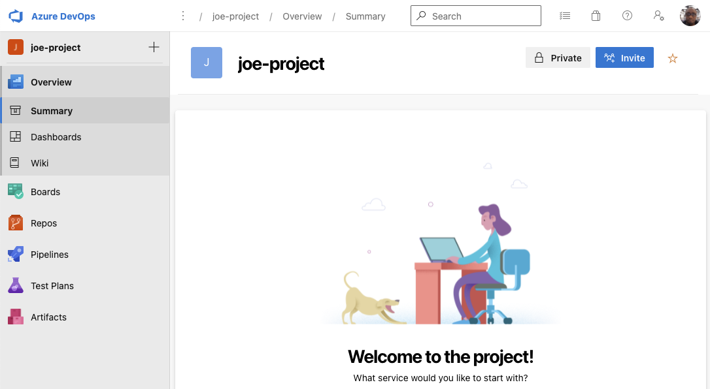

## The Basics

Agile methodology enables an iterative approach which focuses on collaboration, customer feedback and small, rapid releases of software whilst DevOps is considered a practice of bringing development and operations teams together. I need to link my project with GitHub, so I have created a task for that and assigned it to myself, and since I'm doing it now, I have toggled the status to **Doing**. This is handy when working with a team as each person knows what their tasks are and it's easy for management to see who is working on what.

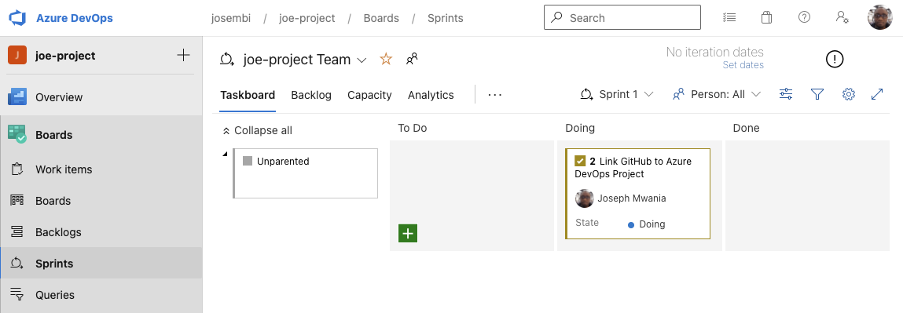

Within GitHub, you can create organizations and in each organization you will have repositories which you can link to your project folder.

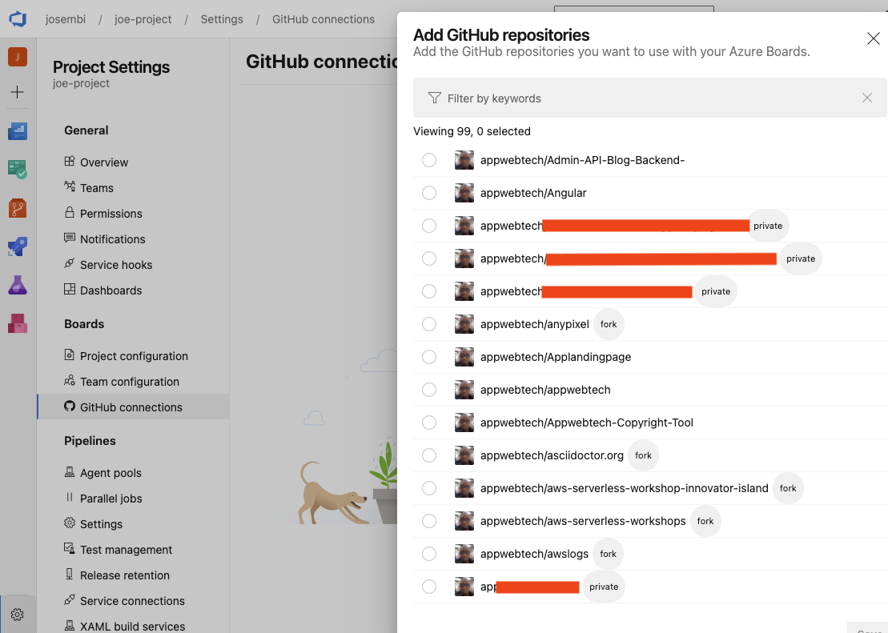

GitHub successfully installed in Azure boards.

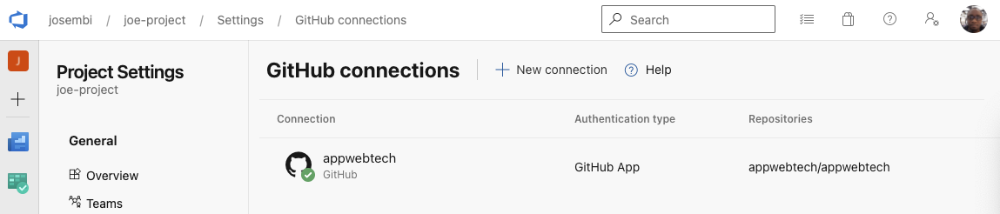

Back on the board, there is the sprint that was assigned to me and because I have finished it, it needs to be flagged as done. I can also commit and create a pull request to reflect changes on GitHub.

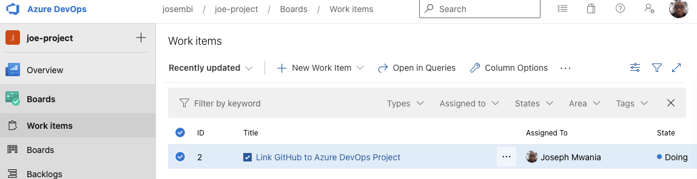

Done with the sprint.

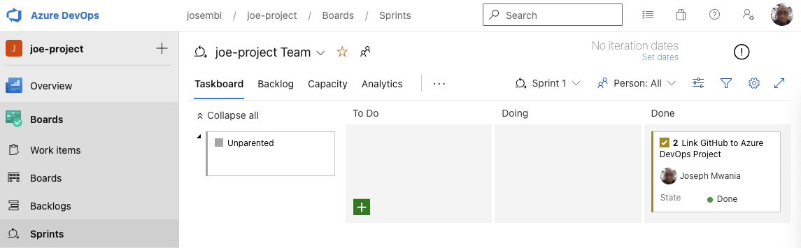

Under boards, the **Query** option enables the Project Manager et al to visualize status and backlogs and make queries of the projects (without any SQL knowledge) using various layers of granularity. They can also select a particular task or sprint and check the progress or read notes on what is happening. Queries can be, emailed, exported as CSV's or even saved for subsequent querying.

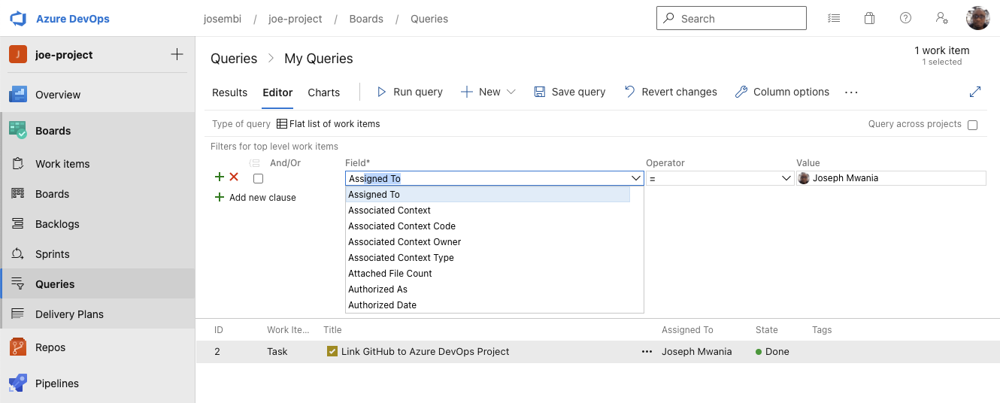

Exported query

```csv
ID,Work Item Type,Title,Assigned To,State,Tags
"2","Task","Link GitHub to Azure DevOps Project","Joseph Mwania <josembi@gmail.com>","Done",
```

**Azure Repos** enable collaboration within a team just by providing a cloud-hosted private Git repos and advanced file management just like in GitHub; the only difference between the two been the evident closed projects in Azure as opposed to GitHubs open source.

I have created a new repo for the project and imported it to Azure. I can work with my repo in Azure and even create new repos there and push them to GitHub. I have also integrated my Azure repo with my local dev environment in VS Studio Code.

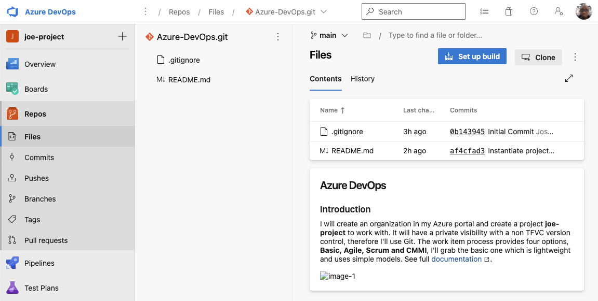

## Azure Pipelines

Building with Azure DevOps Pipelines CI/CD. In a nutshell, **Continuous Integration** involves merging of code from different branches into one single branch in a smooth flawless way. **Continuous Delivery/Deployment** happens after code is merged to a main branch. Code is build to create artifacts which will be deployed to an artifactory like JFrog or repositories like Nexus, GitHub, AWS CodeCommit, etc. This process is what makes up a pipeline.

Azure Pipeline outputs build artifacts with the extensions **.zip, .jay and .exe** and the pipeline can be broken down into two; **Build and Release**.

### Build Pipeline

* Code
* Steps
* Artifact
  
### Release Pipeline

* Test
* Stage
* Prod

### Creating A Build Pipeline

I have created an HTML pipeline and after running it, it failed. This was expected as I haven't created a subscription in Azure. Next, I'll create one and re-run it.

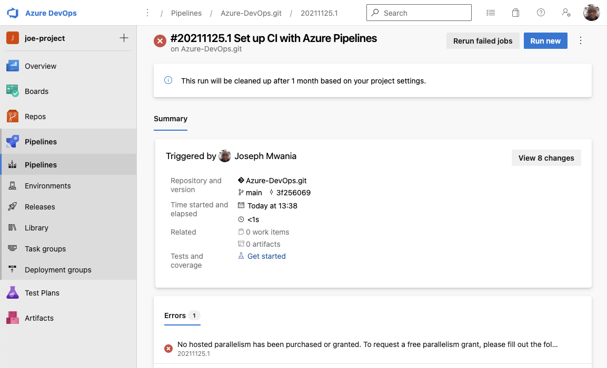

Because there are no **Microsoft-hosted** parallel jobs, I will fix that now.

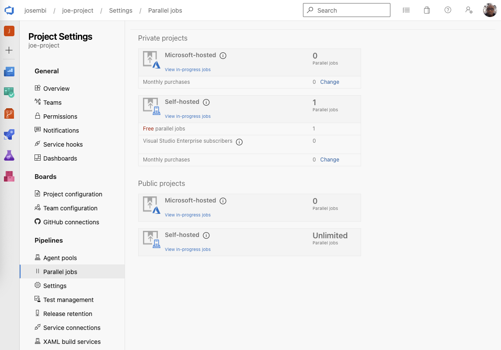

I have set-up billing with Azure and I've linked it up with my organization, next thing to do is to configure a paid parallel job. I'll create only one because I'm not within the free tier in Azure.


Now that's out of the way, I've re-run the job again in Pipelines and it has completed successfully.

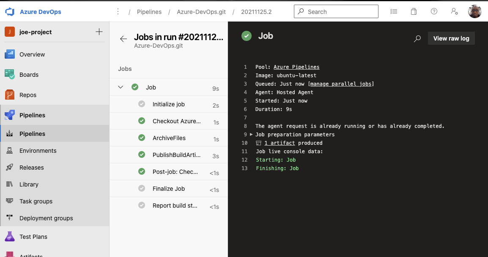

If I wanted to debug incase of errors, just like in **Jenkins**, I can access the logs and see what might have gone wrong.

#### Raw logs
<details>
  <summary>Click to expand and view logs</summary>
  
  ### Console Output
```shell
2021-11-25T13:57:23.3778254Z ##[section]Starting: Job
2021-11-25T13:57:23.8221483Z ##[section]Starting: Initialize job
2021-11-25T13:57:23.8223518Z Agent name: 'Hosted Agent'
2021-11-25T13:57:23.8223974Z Agent machine name: 'fv-az378-853'
2021-11-25T13:57:23.8224219Z Current agent version: '2.195.0'
2021-11-25T13:57:23.8270372Z ##[group]Operating System
2021-11-25T13:57:23.8270619Z Ubuntu
2021-11-25T13:57:23.8270736Z 20.04.3
2021-11-25T13:57:23.8270845Z LTS
2021-11-25T13:57:23.8270995Z ##[endgroup]
2021-11-25T13:57:23.8271144Z ##[group]Virtual Environment
2021-11-25T13:57:23.8271323Z Environment: ubuntu-20.04
2021-11-25T13:57:23.8271501Z Version: 20211122.1
2021-11-25T13:57:23.8271792Z Included Software: https://github.com/actions/virtual-environments/blob/ubuntu20/20211122.1/images/linux/Ubuntu2004-README.md
2021-11-25T13:57:23.8272390Z Image Release: https://github.com/actions/virtual-environments/releases/tag/ubuntu20%2F20211122.1
2021-11-25T13:57:23.8272638Z ##[endgroup]
2021-11-25T13:57:23.8272825Z ##[group]Virtual Environment Provisioner
2021-11-25T13:57:23.8273136Z 1.0.0.0-master-20211123-1
2021-11-25T13:57:23.8273284Z ##[endgroup]
2021-11-25T13:57:23.8274484Z Current image version: '20211122.1'
2021-11-25T13:57:23.8277024Z Agent running as: 'vsts'
2021-11-25T13:57:23.8329674Z Prepare build directory.
2021-11-25T13:57:23.8647961Z Set build variables.
2021-11-25T13:57:23.8682331Z Download all required tasks.
2021-11-25T13:57:23.8812336Z Downloading task: ArchiveFiles (2.189.0)
2021-11-25T13:57:24.6200392Z Downloading task: PublishBuildArtifacts (1.192.0)
2021-11-25T13:57:26.1237154Z Checking job knob settings.
2021-11-25T13:57:26.1246452Z    Knob: AgentToolsDirectory = /opt/hostedtoolcache Source: ${AGENT_TOOLSDIRECTORY} 
2021-11-25T13:57:26.1247495Z    Knob: AgentPerflog = /home/vsts/perflog Source: ${VSTS_AGENT_PERFLOG} 
2021-11-25T13:57:26.1248594Z Finished checking job knob settings.
2021-11-25T13:57:26.1632207Z Start tracking orphan processes.
2021-11-25T13:57:26.1856864Z ##[section]Finishing: Initialize job
2021-11-25T13:57:26.2174257Z ##[section]Starting: Checkout Azure-DevOps.git@main to s
2021-11-25T13:57:26.2465858Z ==============================================================================
2021-11-25T13:57:26.2466494Z Task         : Get sources
2021-11-25T13:57:26.2467002Z Description  : Get sources from a repository. Supports Git, TfsVC, and SVN repositories.
2021-11-25T13:57:26.2467279Z Version      : 1.0.0
2021-11-25T13:57:26.2467681Z Author       : Microsoft
2021-11-25T13:57:26.2468841Z Help         : [More Information](https://go.microsoft.com/fwlink/?LinkId=798199)
2021-11-25T13:57:26.2469326Z ==============================================================================
2021-11-25T13:57:26.7071482Z Syncing repository: Azure-DevOps.git (Git)
2021-11-25T13:57:26.8116240Z ##[command]git version
2021-11-25T13:57:26.8555012Z git version 2.34.0
2021-11-25T13:57:26.8583303Z ##[command]git lfs version
2021-11-25T13:57:26.9215816Z git-lfs/2.13.3 (GitHub; linux amd64; go 1.16.2)
2021-11-25T13:57:26.9423515Z ##[command]git init "/home/vsts/work/1/s"
2021-11-25T13:57:26.9530179Z hint: Using 'master' as the name for the initial branch. This default branch name
2021-11-25T13:57:26.9532541Z hint: is subject to change. To configure the initial branch name to use in all
2021-11-25T13:57:26.9534673Z hint: of your new repositories, which will suppress this warning, call:
2021-11-25T13:57:26.9536181Z hint: 
2021-11-25T13:57:26.9538127Z hint: 	git config --global init.defaultBranch <name>
2021-11-25T13:57:26.9539312Z hint: 
2021-11-25T13:57:26.9541000Z hint: Names commonly chosen instead of 'master' are 'main', 'trunk' and
2021-11-25T13:57:26.9542688Z hint: 'development'. The just-created branch can be renamed via this command:
2021-11-25T13:57:26.9544892Z hint: 
2021-11-25T13:57:26.9547105Z hint: 	git branch -m <name>
2021-11-25T13:57:26.9552151Z Initialized empty Git repository in /home/vsts/work/1/s/.git/
2021-11-25T13:57:26.9581776Z ##[command]git remote add origin https://josembi@dev.azure.com/josembi/joe-project/_git/Azure-DevOps.git
2021-11-25T13:57:26.9645622Z ##[command]git config gc.auto 0
2021-11-25T13:57:26.9693492Z ##[command]git config --get-all http.https://josembi@dev.azure.com/josembi/joe-project/_git/Azure-DevOps.git.extraheader
2021-11-25T13:57:26.9725971Z ##[command]git config --get-all http.proxy
2021-11-25T13:57:26.9752073Z ##[command]git config http.version HTTP/1.1
2021-11-25T13:57:26.9855422Z ##[command]git -c http.extraheader="AUTHORIZATION: bearer ***" fetch --force --tags --prune --prune-tags --progress --no-recurse-submodules origin
2021-11-25T13:57:27.4612408Z remote: Azure Repos        
2021-11-25T13:57:27.4612805Z remote: 
2021-11-25T13:57:27.4731445Z remote: Found 33 objects to send. (43 ms)        
2021-11-25T13:57:27.4733677Z From https://dev.azure.com/josembi/joe-project/_git/Azure-DevOps
2021-11-25T13:57:27.4734532Z  * [new branch]      main       -> origin/main
2021-11-25T13:57:27.5278588Z ##[command]git -c http.extraheader="AUTHORIZATION: bearer ***" fetch --force --tags --prune --prune-tags --progress --no-recurse-submodules origin  +3f2560695fcc6e9c8630ede70dfec27ff7584719
2021-11-25T13:57:27.5284959Z From https://dev.azure.com/josembi/joe-project/_git/Azure-DevOps
2021-11-25T13:57:27.5285904Z  * branch            3f2560695fcc6e9c8630ede70dfec27ff7584719 -> FETCH_HEAD
2021-11-25T13:57:27.5607977Z ##[command]git checkout --progress --force 3f2560695fcc6e9c8630ede70dfec27ff7584719
2021-11-25T13:57:27.5663937Z Note: switching to '3f2560695fcc6e9c8630ede70dfec27ff7584719'.
2021-11-25T13:57:27.5665349Z 
2021-11-25T13:57:27.5665921Z You are in 'detached HEAD' state. You can look around, make experimental
2021-11-25T13:57:27.5666297Z changes and commit them, and you can discard any commits you make in this
2021-11-25T13:57:27.5666809Z state without impacting any branches by switching back to a branch.
2021-11-25T13:57:27.5667114Z 
2021-11-25T13:57:27.5667411Z If you want to create a new branch to retain commits you create, you may
2021-11-25T13:57:27.5668418Z do so (now or later) by using -c with the switch command. Example:
2021-11-25T13:57:27.5668845Z 
2021-11-25T13:57:27.5669325Z   git switch -c <new-branch-name>
2021-11-25T13:57:27.5669775Z 
2021-11-25T13:57:27.5670077Z Or undo this operation with:
2021-11-25T13:57:27.5670212Z 
2021-11-25T13:57:27.5670694Z   git switch -
2021-11-25T13:57:27.5670939Z 
2021-11-25T13:57:27.5671468Z Turn off this advice by setting config variable advice.detachedHead to false
2021-11-25T13:57:27.5671660Z 
2021-11-25T13:57:27.5672250Z HEAD is now at 3f25606 Set up CI with Azure Pipelines
2021-11-25T13:57:27.5736222Z ##[section]Finishing: Checkout Azure-DevOps.git@main to s
2021-11-25T13:57:27.5760331Z ##[section]Starting: ArchiveFiles
2021-11-25T13:57:27.5768220Z ==============================================================================
2021-11-25T13:57:27.5768501Z Task         : Archive files
2021-11-25T13:57:27.5768897Z Description  : Compress files into .7z, .tar.gz, or .zip
2021-11-25T13:57:27.5769104Z Version      : 2.189.0
2021-11-25T13:57:27.5769309Z Author       : Microsoft Corporation
2021-11-25T13:57:27.5769605Z Help         : https://docs.microsoft.com/azure/devops/pipelines/tasks/utility/archive-files
2021-11-25T13:57:27.5769925Z ==============================================================================
2021-11-25T13:57:28.7240557Z Found 5 files
2021-11-25T13:57:28.7241039Z Archiving file: .git
2021-11-25T13:57:28.7241392Z Archiving file: .gitignore
2021-11-25T13:57:28.7241730Z Archiving file: README.md
2021-11-25T13:57:28.7242324Z Archiving file: azure-pipelines.yml
2021-11-25T13:57:28.7242717Z Archiving file: images
2021-11-25T13:57:28.7257491Z files=.git
2021-11-25T13:57:28.7258933Z files=.gitignore
2021-11-25T13:57:28.7259587Z files=README.md
2021-11-25T13:57:28.7260632Z files=azure-pipelines.yml
2021-11-25T13:57:28.7261433Z files=images
2021-11-25T13:57:28.7267370Z [command]/usr/bin/zip -r /home/vsts/work/1/a/2.zip .git .gitignore README.md azure-pipelines.yml images
2021-11-25T13:57:28.7267887Z   adding: .git/ (stored 0%)
2021-11-25T13:57:28.7268154Z   adding: .git/branches/ (stored 0%)
2021-11-25T13:57:28.7268634Z   adding: .git/HEAD (deflated 2%)
2021-11-25T13:57:28.7268893Z   adding: .git/logs/ (stored 0%)
2021-11-25T13:57:28.7269138Z   adding: .git/logs/HEAD (deflated 40%)
2021-11-25T13:57:28.7269391Z   adding: .git/logs/refs/ (stored 0%)
2021-11-25T13:57:28.7269841Z   adding: .git/logs/refs/remotes/ (stored 0%)
2021-11-25T13:57:28.7270127Z   adding: .git/logs/refs/remotes/origin/ (stored 0%)
2021-11-25T13:57:28.7270451Z   adding: .git/logs/refs/remotes/origin/main (deflated 32%)
2021-11-25T13:57:28.7270734Z   adding: .git/objects/ (stored 0%)
2021-11-25T13:57:28.7270995Z   adding: .git/objects/78/ (stored 0%)
2021-11-25T13:57:28.7271324Z   adding: .git/objects/78/e1fcaf053418876b8a921e79a5878c0ac0bc03 (stored 0%)
2021-11-25T13:57:28.7271634Z   adding: .git/objects/98/ (stored 0%)
2021-11-25T13:57:28.7271964Z   adding: .git/objects/98/1a36313ad1eda09d574a457490630edeb7227b (deflated 0%)
2021-11-25T13:57:28.7272276Z   adding: .git/objects/aa/ (stored 0%)
2021-11-25T13:57:28.7272607Z   adding: .git/objects/aa/ec0b79328e43732413da22ad1a80f3dedc5678 (stored 0%)
2021-11-25T13:57:28.7272967Z   adding: .git/objects/aa/ebb8d79da7875493f47814060a3adb3bf529fe (stored 0%)
2021-11-25T13:57:28.7273275Z   adding: .git/objects/76/ (stored 0%)
2021-11-25T13:57:28.7273603Z   adding: .git/objects/76/11a879a748ec41ece03f5765b701987832f783 (stored 0%)
2021-11-25T13:57:28.7274089Z   adding: .git/objects/3e/ (stored 0%)
2021-11-25T13:57:28.7274685Z   adding: .git/objects/3e/c7ce54e4142b6ae7be83865a52091a5b550fef (stored 0%)
2021-11-25T13:57:28.7275020Z   adding: .git/objects/87/ (stored 0%)
2021-11-25T13:57:28.7275355Z   adding: .git/objects/87/1fba92d778e7feac6b10d0d35f640ee4a8b5f6 (deflated 0%)
2021-11-25T13:57:28.7276401Z   adding: .git/objects/3f/ (stored 0%)
2021-11-25T13:57:28.7277086Z   adding: .git/objects/3f/2560695fcc6e9c8630ede70dfec27ff7584719 (stored 0%)
2021-11-25T13:57:28.7277625Z   adding: .git/objects/42/ (stored 0%)
2021-11-25T13:57:28.7278306Z   adding: .git/objects/42/ba67d196013acfcc81e6289678072f43dafb89 (stored 0%)
2021-11-25T13:57:28.7278648Z   adding: .git/objects/5d/ (stored 0%)
2021-11-25T13:57:28.7278971Z   adding: .git/objects/5d/38c9cb5f9c0a621c3bdaa3156fd2e56af41124 (deflated 0%)
2021-11-25T13:57:28.7279292Z   adding: .git/objects/6a/ (stored 0%)
2021-11-25T13:57:28.7279627Z   adding: .git/objects/6a/7c0ecfdf18660c82963aaacf1d4fd6a97846a3 (stored 0%)
2021-11-25T13:57:28.7279944Z   adding: .git/objects/a9/ (stored 0%)
2021-11-25T13:57:28.7280279Z   adding: .git/objects/a9/ac03afd41600da03947ecddcdf28aa38270266 (stored 0%)
2021-11-25T13:57:28.7280755Z   adding: .git/objects/b7/ (stored 0%)
2021-11-25T13:57:28.7281254Z   adding: .git/objects/b7/103d38bfc4b9561126f141c2a2ce38f3ebf74b (stored 0%)
2021-11-25T13:57:28.7281582Z   adding: .git/objects/e6/ (stored 0%)
2021-11-25T13:57:28.7281892Z   adding: .git/objects/e6/9de29bb2d1d6434b8b29ae775ad8c2e48c5391 (stored 0%)
2021-11-25T13:57:28.7282221Z   adding: .git/objects/pack/ (stored 0%)
2021-11-25T13:57:28.7282484Z   adding: .git/objects/05/ (stored 0%)
2021-11-25T13:57:28.7282815Z   adding: .git/objects/05/0936255f559ab54816e982abd3825f75bd8513 (stored 0%)
2021-11-25T13:57:28.7283125Z   adding: .git/objects/3d/ (stored 0%)
2021-11-25T13:57:28.7283435Z   adding: .git/objects/3d/6c5f4c569709e31687fd913c43fe2fab863663 (stored 0%)
2021-11-25T13:57:28.7283762Z   adding: .git/objects/ce/ (stored 0%)
2021-11-25T13:57:28.7284070Z   adding: .git/objects/ce/288a5b641607d8f8518a11ed989dff22e3b4e7 (stored 0%)
2021-11-25T13:57:28.7284396Z   adding: .git/objects/b6/ (stored 0%)
2021-11-25T13:57:28.7284710Z   adding: .git/objects/b6/3b06cec48a39bd548416ffc6a5a7a0eb856bb0 (deflated 0%)
2021-11-25T13:57:28.7285021Z   adding: .git/objects/af/ (stored 0%)
2021-11-25T13:57:28.7285349Z   adding: .git/objects/af/4cfad30142523ddb7634d75ce0c3ecc25bf9cf (stored 0%)
2021-11-25T13:57:28.7285660Z   adding: .git/objects/info/ (stored 0%)
2021-11-25T13:57:28.7285940Z   adding: .git/objects/d0/ (stored 0%)
2021-11-25T13:57:28.7286248Z   adding: .git/objects/d0/aa624332e5ef9b26509bb39688187b931a8786 (stored 0%)
2021-11-25T13:57:28.7286667Z   adding: .git/objects/a0/ (stored 0%)
2021-11-25T13:57:28.7286976Z   adding: .git/objects/a0/340ecabb9283fbc4fcee4e315e574ad715ca62 (stored 0%)
2021-11-25T13:57:28.7287282Z   adding: .git/objects/0b/ (stored 0%)
2021-11-25T13:57:28.7287607Z   adding: .git/objects/0b/14394573a40bafdf03a0c3b94cb477aa24d332 (stored 0%)
2021-11-25T13:57:28.7287914Z   adding: .git/objects/16/ (stored 0%)
2021-11-25T13:57:28.7288285Z   adding: .git/objects/16/0093a5b04be9e0255f6c546929789cefdea265 (stored 0%)
2021-11-25T13:57:28.7288606Z   adding: .git/objects/8e/ (stored 0%)
2021-11-25T13:57:28.7289117Z   adding: .git/objects/8e/d06127965861beb01beff0c2e009c6a2456957 (deflated 0%)
2021-11-25T13:57:28.7289435Z   adding: .git/objects/23/ (stored 0%)
2021-11-25T13:57:28.7289777Z   adding: .git/objects/23/0817a32897f5d5beb9dc155b08d5cd772c811c (stored 0%)
2021-11-25T13:57:28.7290089Z   adding: .git/objects/3a/ (stored 0%)
2021-11-25T13:57:28.7290526Z   adding: .git/objects/3a/e332b4ba999bb3f51c97551bcd2dca3bd712c2 (deflated 0%)
2021-11-25T13:57:28.7290845Z   adding: .git/objects/fe/ (stored 0%)
2021-11-25T13:57:28.7291214Z   adding: .git/objects/fe/5ac0bf9ab89fecc1775347fcb4c51bed3fdd63 (deflated 0%)
2021-11-25T13:57:28.7291527Z   adding: .git/objects/58/ (stored 0%)
2021-11-25T13:57:28.7292156Z   adding: .git/objects/58/01d0eba17c3831d03b8e58c1c2d43957292d3f (deflated 0%)
2021-11-25T13:57:28.7292570Z   adding: .git/objects/58/cc5457f055420f7a0bf331fa4a115c2117657c (stored 0%)
2021-11-25T13:57:28.7292890Z   adding: .git/objects/4d/ (stored 0%)
2021-11-25T13:57:28.7293288Z   adding: .git/objects/4d/74926eacdaeab7d975be0fbbc635bafa33dbf8 (stored 0%)
2021-11-25T13:57:28.7293598Z   adding: .git/objects/8f/ (stored 0%)
2021-11-25T13:57:28.7293966Z   adding: .git/objects/8f/5d31d67f265bc31eb12844c05c4a50ea7de43c (stored 0%)
2021-11-25T13:57:28.7294277Z   adding: .git/objects/eb/ (stored 0%)
2021-11-25T13:57:28.7294794Z   adding: .git/objects/eb/78883195228bf1a21b44f84333cd1d1303c6be (stored 0%)
2021-11-25T13:57:28.7295344Z   adding: .git/objects/ae/ (stored 0%)
2021-11-25T13:57:28.7295654Z   adding: .git/objects/ae/43ed98a20c7efc0ad259367cc25d34a6381a4d (stored 0%)
2021-11-25T13:57:28.7296014Z   adding: .git/hooks/ (stored 0%)
2021-11-25T13:57:28.7296553Z   adding: .git/hooks/post-update.sample (deflated 27%)
2021-11-25T13:57:28.7297109Z   adding: .git/hooks/prepare-commit-msg.sample (deflated 50%)
2021-11-25T13:57:28.7297594Z   adding: .git/hooks/pre-rebase.sample (deflated 59%)
2021-11-25T13:57:28.7298204Z   adding: .git/hooks/applypatch-msg.sample (deflated 42%)
2021-11-25T13:57:28.7298872Z   adding: .git/hooks/pre-applypatch.sample (deflated 38%)
2021-11-25T13:57:28.7302454Z   adding: .git/hooks/fsmonitor-watchman.sample (deflated 62%)
2021-11-25T13:57:28.7303291Z   adding: .git/hooks/commit-msg.sample (deflated 44%)
2021-11-25T13:57:28.7303980Z   adding: .git/hooks/pre-receive.sample (deflated 40%)
2021-11-25T13:57:28.7304419Z   adding: .git/hooks/pre-push.sample (deflated 49%)
2021-11-25T13:57:28.7304987Z   adding: .git/hooks/pre-merge-commit.sample (deflated 39%)
2021-11-25T13:57:28.7305298Z   adding: .git/hooks/update.sample (deflated 68%)
2021-11-25T13:57:28.7305806Z   adding: .git/hooks/pre-commit.sample (deflated 45%)
2021-11-25T13:57:28.7306316Z   adding: .git/hooks/push-to-checkout.sample (deflated 55%)
2021-11-25T13:57:28.7306674Z   adding: .git/FETCH_HEAD (deflated 26%)
2021-11-25T13:57:28.7306936Z   adding: .git/description (deflated 14%)
2021-11-25T13:57:28.7307186Z   adding: .git/info/ (stored 0%)
2021-11-25T13:57:28.7307500Z   adding: .git/info/exclude (deflated 28%)
2021-11-25T13:57:28.7307758Z   adding: .git/index (deflated 48%)
2021-11-25T13:57:28.7308062Z   adding: .git/refs/ (stored 0%)
2021-11-25T13:57:28.7308308Z   adding: .git/refs/heads/ (stored 0%)
2021-11-25T13:57:28.7308564Z   adding: .git/refs/remotes/ (stored 0%)
2021-11-25T13:57:28.7309060Z   adding: .git/refs/remotes/origin/ (stored 0%)
2021-11-25T13:57:28.7309351Z   adding: .git/refs/remotes/origin/main (deflated 2%)
2021-11-25T13:57:28.7309960Z   adding: .git/refs/tags/ (stored 0%)
2021-11-25T13:57:28.7310220Z   adding: .git/config (deflated 28%)
2021-11-25T13:57:28.7310543Z   adding: .gitignore (deflated 20%)
2021-11-25T13:57:28.7310803Z   adding: README.md (deflated 51%)
2021-11-25T13:57:28.7311267Z   adding: azure-pipelines.yml (deflated 31%)
2021-11-25T13:57:28.7311605Z   adding: images/ (stored 0%)
2021-11-25T13:57:28.7312014Z   adding: images/image-4.png (deflated 7%)
2021-11-25T13:57:28.7312497Z   adding: images/image-5.png (deflated 7%)
2021-11-25T13:57:28.7312941Z   adding: images/image-1.png (deflated 7%)
2021-11-25T13:57:28.7313369Z   adding: images/image-7.png (deflated 11%)
2021-11-25T13:57:28.7313861Z   adding: images/image-3.png (deflated 5%)
2021-11-25T13:57:28.7314286Z   adding: images/image-2.png (deflated 10%)
2021-11-25T13:57:28.7314769Z   adding: images/image-6.png (deflated 8%)
2021-11-25T13:57:28.7315203Z   adding: images/image-8.png (deflated 8%)
2021-11-25T13:57:28.7369727Z ##[section]Finishing: ArchiveFiles
2021-11-25T13:57:28.7391293Z ##[section]Starting: PublishBuildArtifacts
2021-11-25T13:57:28.7398811Z ==============================================================================
2021-11-25T13:57:28.7399162Z Task         : Publish build artifacts
2021-11-25T13:57:28.7399425Z Description  : Publish build artifacts to Azure Pipelines or a Windows file share
2021-11-25T13:57:28.7399822Z Version      : 1.192.0
2021-11-25T13:57:28.7400060Z Author       : Microsoft Corporation
2021-11-25T13:57:28.7400337Z Help         : https://docs.microsoft.com/azure/devops/pipelines/tasks/utility/publish-build-artifacts
2021-11-25T13:57:28.7401661Z ==============================================================================
2021-11-25T13:57:29.6767099Z ##[section]Async Command Start: Upload Artifact
2021-11-25T13:57:29.6767429Z Uploading 1 files
2021-11-25T13:57:29.6767565Z Building file tree
2021-11-25T13:57:30.1727008Z Uploaded 0 out of 1,458,494 bytes.
2021-11-25T13:57:31.6745851Z Uploaded 1,458,494 out of 1,458,494 bytes.
2021-11-25T13:57:31.6746267Z Associating files
2021-11-25T13:57:31.6746455Z Total files: 1 ---- Associated files: 0 (0%)
2021-11-25T13:57:32.5982016Z File upload succeed.
2021-11-25T13:57:32.5982342Z Upload '/home/vsts/work/1/a' to file container: '#/16579167/drop'
2021-11-25T13:57:32.5982702Z Associated artifact 1 with build 2
2021-11-25T13:57:32.5982900Z ##[section]Async Command End: Upload Artifact
2021-11-25T13:57:32.5984419Z ##[section]Finishing: PublishBuildArtifacts
2021-11-25T13:57:32.6007141Z ##[section]Starting: Checkout Azure-DevOps.git@main to s
2021-11-25T13:57:32.6012527Z ==============================================================================
2021-11-25T13:57:32.6012992Z Task         : Get sources
2021-11-25T13:57:32.6013417Z Description  : Get sources from a repository. Supports Git, TfsVC, and SVN repositories.
2021-11-25T13:57:32.6013826Z Version      : 1.0.0
2021-11-25T13:57:32.6013996Z Author       : Microsoft
2021-11-25T13:57:32.6014294Z Help         : [More Information](https://go.microsoft.com/fwlink/?LinkId=798199)
2021-11-25T13:57:32.6014603Z ==============================================================================
2021-11-25T13:57:32.9516815Z Cleaning any cached credential from repository: Azure-DevOps.git (Git)
2021-11-25T13:57:32.9581905Z ##[section]Finishing: Checkout Azure-DevOps.git@main to s
2021-11-25T13:57:32.9643592Z ##[section]Starting: Finalize Job
2021-11-25T13:57:32.9678308Z Cleaning up task key
2021-11-25T13:57:32.9679669Z Start cleaning up orphan processes.
2021-11-25T13:57:32.9933212Z ##[section]Finishing: Finalize Job
2021-11-25T13:57:32.9974568Z ##[section]Finishing: Job
```
</details>

### Creating A Release Pipeline

