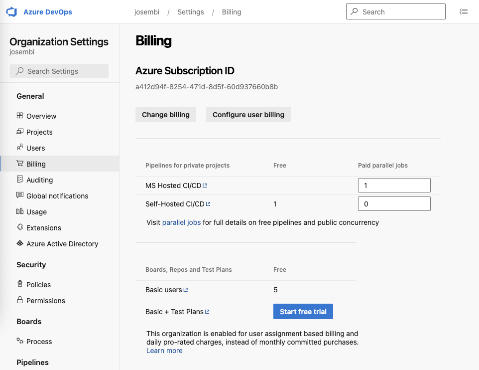
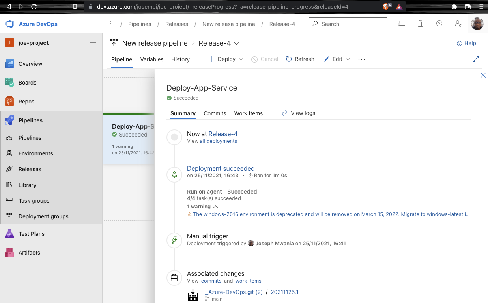

# Azure DevOps

## Introduction

I will create an organization in my Azure portal and create a project **joe-project** to work with. It will have a private visibility with a non TFVC version control, therefore I'll use Git. The work item process provides four options, **Basic, Agile, Scrum and CMMI**, I'll grab the basic one which is lightweight and uses simple models. See full [documentation](https://docs.microsoft.com/en-us/azure/devops/boards/work-items/guidance/choose-process?view=azure-devops&tabs=basic-process).


## The Basics

Agile methodology enables an iterative approach which focuses on collaboration, customer feedback and small, rapid releases of software whilst DevOps is considered a practice of bringing development and operations teams together. I need to link my project with GitHub, so I have created a task for that and assigned it to myself, and since I'm doing it now, I have toggled the status to **Doing**. This is handy when working with a team as each person knows what their tasks are and it's easy for management to see who is working on what.


Within GitHub, you can create organizations and in each organization you will have repositories which you can link to your project folder.


GitHub successfully installed in Azure boards.


Back on the board, there is the sprint that was assigned to me and because I have finished it, it needs to be flagged as done. I can also commit and create a pull request to reflect changes on GitHub.


Done with the sprint.


Under boards, the **Query** option enables the Project Manager et al to visualize status and backlogs and make queries of the projects (without any SQL knowledge) using various layers of granularity. They can also select a particular task or sprint and check the progress or read notes on what is happening. Queries can be, emailed, exported as CSV's or even saved for subsequent querying.


Exported query

```csv
ID,Work Item Type,Title,Assigned To,State,Tags
"2","Task","Link GitHub to Azure DevOps Project","Joseph Mwania <josembi@gmail.com>","Done",
```

**Azure Repos** enable collaboration within a team just by providing a cloud-hosted private Git repos and advanced file management just like in GitHub; the only difference between the two been the evident closed projects in Azure as opposed to GitHubs open source.

I have created a new repo for the project and imported it to Azure. I can work with my repo in Azure and even create new repos there and push them to GitHub. I have also integrated my Azure repo with my local dev environment in VS Studio Code.


## Azure Pipelines

Building with Azure DevOps Pipelines CI/CD. In a nutshell, **Continuous Integration** involves merging of code from different branches into one single branch in a smooth flawless way. **Continuous Delivery/Deployment** happens after code is merged to a main branch. Code is build to create artifacts which will be deployed to an artifactory like JFrog or repositories like Nexus, GitHub, AWS CodeCommit, etc. This process is what makes up a pipeline.

Azure Pipeline outputs build artifacts with the extensions **.zip, .jay and .exe** and the pipeline can be broken down into two; **Build and Release**.

### Build Pipeline

* Code
* Steps
* Artifact
  
### Release Pipeline

* Test
* Stage
* Prod

### Creating A Build Pipeline

I have created an HTML pipeline and after running it, it failed. This was expected as I haven't created a subscription in Azure. Next, I'll create one and re-run it.


Because there are no **Microsoft-hosted** parallel jobs, I will fix that now.


I have set-up billing with Azure and I've linked it up with my organization, next thing to do is to configure a paid parallel job. I'll create only one because I'm not within the free tier in Azure.



Now that's out of the way, I've re-run the job again in Pipelines and it has completed successfully.


If I wanted to debug incase of errors, just like in **Jenkins**, I can access the logs and see what might have gone wrong.

#### Raw logs

<details>
  <summary>Click to expand and view logs</summary>
  
  ### Console Output

```shell
2021-11-25T13:57:23.3778254Z ##[section]Starting: Job
2021-11-25T13:57:23.8221483Z ##[section]Starting: Initialize job
2021-11-25T13:57:23.8223518Z Agent name: 'Hosted Agent'
2021-11-25T13:57:23.8223974Z Agent machine name: 'fv-az378-853'
2021-11-25T13:57:23.8224219Z Current agent version: '2.195.0'
2021-11-25T13:57:23.8270372Z ##[group]Operating System
2021-11-25T13:57:23.8270619Z Ubuntu
2021-11-25T13:57:23.8270736Z 20.04.3
2021-11-25T13:57:23.8270845Z LTS
2021-11-25T13:57:23.8270995Z ##[endgroup]
2021-11-25T13:57:23.8271144Z ##[group]Virtual Environment
2021-11-25T13:57:23.8271323Z Environment: ubuntu-20.04
2021-11-25T13:57:23.8271501Z Version: 20211122.1
2021-11-25T13:57:23.8271792Z Included Software: https://github.com/actions/virtual-environments/blob/ubuntu20/20211122.1/images/linux/Ubuntu2004-README.md
2021-11-25T13:57:23.8272390Z Image Release: https://github.com/actions/virtual-environments/releases/tag/ubuntu20%2F20211122.1
2021-11-25T13:57:23.8272638Z ##[endgroup]
2021-11-25T13:57:23.8272825Z ##[group]Virtual Environment Provisioner
2021-11-25T13:57:23.8273136Z 1.0.0.0-master-20211123-1
2021-11-25T13:57:23.8273284Z ##[endgroup]
2021-11-25T13:57:23.8274484Z Current image version: '20211122.1'
2021-11-25T13:57:23.8277024Z Agent running as: 'vsts'
2021-11-25T13:57:23.8329674Z Prepare build directory.
2021-11-25T13:57:23.8647961Z Set build variables.
2021-11-25T13:57:23.8682331Z Download all required tasks.
2021-11-25T13:57:23.8812336Z Downloading task: ArchiveFiles (2.189.0)
2021-11-25T13:57:24.6200392Z Downloading task: PublishBuildArtifacts (1.192.0)
2021-11-25T13:57:26.1237154Z Checking job knob settings.
2021-11-25T13:57:26.1246452Z    Knob: AgentToolsDirectory = /opt/hostedtoolcache Source: ${AGENT_TOOLSDIRECTORY} 
2021-11-25T13:57:26.1247495Z    Knob: AgentPerflog = /home/vsts/perflog Source: ${VSTS_AGENT_PERFLOG} 
2021-11-25T13:57:26.1248594Z Finished checking job knob settings.
2021-11-25T13:57:26.1632207Z Start tracking orphan processes.
2021-11-25T13:57:26.1856864Z ##[section]Finishing: Initialize job
2021-11-25T13:57:26.2174257Z ##[section]Starting: Checkout Azure-DevOps.git@main to s
2021-11-25T13:57:26.2465858Z ==============================================================================
2021-11-25T13:57:26.2466494Z Task         : Get sources
2021-11-25T13:57:26.2467002Z Description  : Get sources from a repository. Supports Git, TfsVC, and SVN repositories.
2021-11-25T13:57:26.2467279Z Version      : 1.0.0
2021-11-25T13:57:26.2467681Z Author       : Microsoft
2021-11-25T13:57:26.2468841Z Help         : [More Information](https://go.microsoft.com/fwlink/?LinkId=798199)
2021-11-25T13:57:26.2469326Z ==============================================================================
2021-11-25T13:57:26.7071482Z Syncing repository: Azure-DevOps.git (Git)
2021-11-25T13:57:26.8116240Z ##[command]git version
2021-11-25T13:57:26.8555012Z git version 2.34.0
2021-11-25T13:57:26.8583303Z ##[command]git lfs version
2021-11-25T13:57:26.9215816Z git-lfs/2.13.3 (GitHub; linux amd64; go 1.16.2)
2021-11-25T13:57:26.9423515Z ##[command]git init "/home/vsts/work/1/s"
2021-11-25T13:57:26.9530179Z hint: Using 'master' as the name for the initial branch. This default branch name
2021-11-25T13:57:26.9532541Z hint: is subject to change. To configure the initial branch name to use in all
2021-11-25T13:57:26.9534673Z hint: of your new repositories, which will suppress this warning, call:
2021-11-25T13:57:26.9536181Z hint: 
2021-11-25T13:57:26.9538127Z hint: 	git config --global init.defaultBranch <name>
2021-11-25T13:57:26.9539312Z hint: 
2021-11-25T13:57:26.9541000Z hint: Names commonly chosen instead of 'master' are 'main', 'trunk' and
2021-11-25T13:57:26.9542688Z hint: 'development'. The just-created branch can be renamed via this command:
2021-11-25T13:57:26.9544892Z hint: 
2021-11-25T13:57:26.9547105Z hint: 	git branch -m <name>
2021-11-25T13:57:26.9552151Z Initialized empty Git repository in /home/vsts/work/1/s/.git/
2021-11-25T13:57:26.9581776Z ##[command]git remote add origin https://josembi@dev.azure.com/josembi/joe-project/_git/Azure-DevOps.git
2021-11-25T13:57:26.9645622Z ##[command]git config gc.auto 0
2021-11-25T13:57:26.9693492Z ##[command]git config --get-all http.https://josembi@dev.azure.com/josembi/joe-project/_git/Azure-DevOps.git.extraheader
2021-11-25T13:57:26.9725971Z ##[command]git config --get-all http.proxy
2021-11-25T13:57:26.9752073Z ##[command]git config http.version HTTP/1.1
2021-11-25T13:57:26.9855422Z ##[command]git -c http.extraheader="AUTHORIZATION: bearer ***" fetch --force --tags --prune --prune-tags --progress --no-recurse-submodules origin
2021-11-25T13:57:27.4612408Z remote: Azure Repos        
2021-11-25T13:57:27.4612805Z remote: 
2021-11-25T13:57:27.4731445Z remote: Found 33 objects to send. (43 ms)        
2021-11-25T13:57:27.4733677Z From https://dev.azure.com/josembi/joe-project/_git/Azure-DevOps
2021-11-25T13:57:27.4734532Z  * [new branch]      main       -> origin/main
2021-11-25T13:57:27.5278588Z ##[command]git -c http.extraheader="AUTHORIZATION: bearer ***" fetch --force --tags --prune --prune-tags --progress --no-recurse-submodules origin  +3f2560695fcc6e9c8630ede70dfec27ff7584719
2021-11-25T13:57:27.5284959Z From https://dev.azure.com/josembi/joe-project/_git/Azure-DevOps
2021-11-25T13:57:27.5285904Z  * branch            3f2560695fcc6e9c8630ede70dfec27ff7584719 -> FETCH_HEAD
2021-11-25T13:57:27.5607977Z ##[command]git checkout --progress --force 3f2560695fcc6e9c8630ede70dfec27ff7584719
2021-11-25T13:57:27.5663937Z Note: switching to '3f2560695fcc6e9c8630ede70dfec27ff7584719'.
2021-11-25T13:57:27.5665349Z 
2021-11-25T13:57:27.5665921Z You are in 'detached HEAD' state. You can look around, make experimental
2021-11-25T13:57:27.5666297Z changes and commit them, and you can discard any commits you make in this
2021-11-25T13:57:27.5666809Z state without impacting any branches by switching back to a branch.
2021-11-25T13:57:27.5667114Z 
2021-11-25T13:57:27.5667411Z If you want to create a new branch to retain commits you create, you may
2021-11-25T13:57:27.5668418Z do so (now or later) by using -c with the switch command. Example:
2021-11-25T13:57:27.5668845Z 
2021-11-25T13:57:27.5669325Z   git switch -c <new-branch-name>
2021-11-25T13:57:27.5669775Z 
2021-11-25T13:57:27.5670077Z Or undo this operation with:
2021-11-25T13:57:27.5670212Z 
2021-11-25T13:57:27.5670694Z   git switch -
2021-11-25T13:57:27.5670939Z 
2021-11-25T13:57:27.5671468Z Turn off this advice by setting config variable advice.detachedHead to false
2021-11-25T13:57:27.5671660Z 
2021-11-25T13:57:27.5672250Z HEAD is now at 3f25606 Set up CI with Azure Pipelines
2021-11-25T13:57:27.5736222Z ##[section]Finishing: Checkout Azure-DevOps.git@main to s
2021-11-25T13:57:27.5760331Z ##[section]Starting: ArchiveFiles
2021-11-25T13:57:27.5768220Z ==============================================================================
2021-11-25T13:57:27.5768501Z Task         : Archive files
2021-11-25T13:57:27.5768897Z Description  : Compress files into .7z, .tar.gz, or .zip
2021-11-25T13:57:27.5769104Z Version      : 2.189.0
2021-11-25T13:57:27.5769309Z Author       : Microsoft Corporation
2021-11-25T13:57:27.5769605Z Help         : https://docs.microsoft.com/azure/devops/pipelines/tasks/utility/archive-files
2021-11-25T13:57:27.5769925Z ==============================================================================
2021-11-25T13:57:28.7240557Z Found 5 files
2021-11-25T13:57:28.7241039Z Archiving file: .git
2021-11-25T13:57:28.7241392Z Archiving file: .gitignore
2021-11-25T13:57:28.7241730Z Archiving file: README.md
2021-11-25T13:57:28.7242324Z Archiving file: azure-pipelines.yml
2021-11-25T13:57:28.7242717Z Archiving file: images
2021-11-25T13:57:28.7257491Z files=.git
2021-11-25T13:57:28.7258933Z files=.gitignore
2021-11-25T13:57:28.7259587Z files=README.md
2021-11-25T13:57:28.7260632Z files=azure-pipelines.yml
2021-11-25T13:57:28.7261433Z files=images
2021-11-25T13:57:28.7267370Z [command]/usr/bin/zip -r /home/vsts/work/1/a/2.zip .git .gitignore README.md azure-pipelines.yml images
2021-11-25T13:57:28.7267887Z   adding: .git/ (stored 0%)
2021-11-25T13:57:28.7268154Z   adding: .git/branches/ (stored 0%)
2021-11-25T13:57:28.7268634Z   adding: .git/HEAD (deflated 2%)
2021-11-25T13:57:28.7268893Z   adding: .git/logs/ (stored 0%)
2021-11-25T13:57:28.7269138Z   adding: .git/logs/HEAD (deflated 40%)
2021-11-25T13:57:28.7269391Z   adding: .git/logs/refs/ (stored 0%)
2021-11-25T13:57:28.7269841Z   adding: .git/logs/refs/remotes/ (stored 0%)
2021-11-25T13:57:28.7270127Z   adding: .git/logs/refs/remotes/origin/ (stored 0%)
2021-11-25T13:57:28.7270451Z   adding: .git/logs/refs/remotes/origin/main (deflated 32%)
2021-11-25T13:57:28.7270734Z   adding: .git/objects/ (stored 0%)
2021-11-25T13:57:28.7270995Z   adding: .git/objects/78/ (stored 0%)
2021-11-25T13:57:28.7271324Z   adding: .git/objects/78/e1fcaf053418876b8a921e79a5878c0ac0bc03 (stored 0%)
2021-11-25T13:57:28.7271634Z   adding: .git/objects/98/ (stored 0%)
2021-11-25T13:57:28.7271964Z   adding: .git/objects/98/1a36313ad1eda09d574a457490630edeb7227b (deflated 0%)
2021-11-25T13:57:28.7272276Z   adding: .git/objects/aa/ (stored 0%)
2021-11-25T13:57:28.7272607Z   adding: .git/objects/aa/ec0b79328e43732413da22ad1a80f3dedc5678 (stored 0%)
2021-11-25T13:57:28.7272967Z   adding: .git/objects/aa/ebb8d79da7875493f47814060a3adb3bf529fe (stored 0%)
2021-11-25T13:57:28.7273275Z   adding: .git/objects/76/ (stored 0%)
2021-11-25T13:57:28.7273603Z   adding: .git/objects/76/11a879a748ec41ece03f5765b701987832f783 (stored 0%)
2021-11-25T13:57:28.7274089Z   adding: .git/objects/3e/ (stored 0%)
2021-11-25T13:57:28.7274685Z   adding: .git/objects/3e/c7ce54e4142b6ae7be83865a52091a5b550fef (stored 0%)
2021-11-25T13:57:28.7275020Z   adding: .git/objects/87/ (stored 0%)
2021-11-25T13:57:28.7275355Z   adding: .git/objects/87/1fba92d778e7feac6b10d0d35f640ee4a8b5f6 (deflated 0%)
2021-11-25T13:57:28.7276401Z   adding: .git/objects/3f/ (stored 0%)
2021-11-25T13:57:28.7277086Z   adding: .git/objects/3f/2560695fcc6e9c8630ede70dfec27ff7584719 (stored 0%)
2021-11-25T13:57:28.7277625Z   adding: .git/objects/42/ (stored 0%)
2021-11-25T13:57:28.7278306Z   adding: .git/objects/42/ba67d196013acfcc81e6289678072f43dafb89 (stored 0%)
2021-11-25T13:57:28.7278648Z   adding: .git/objects/5d/ (stored 0%)
2021-11-25T13:57:28.7278971Z   adding: .git/objects/5d/38c9cb5f9c0a621c3bdaa3156fd2e56af41124 (deflated 0%)
2021-11-25T13:57:28.7279292Z   adding: .git/objects/6a/ (stored 0%)
2021-11-25T13:57:28.7279627Z   adding: .git/objects/6a/7c0ecfdf18660c82963aaacf1d4fd6a97846a3 (stored 0%)
2021-11-25T13:57:28.7279944Z   adding: .git/objects/a9/ (stored 0%)
2021-11-25T13:57:28.7280279Z   adding: .git/objects/a9/ac03afd41600da03947ecddcdf28aa38270266 (stored 0%)
2021-11-25T13:57:28.7280755Z   adding: .git/objects/b7/ (stored 0%)
2021-11-25T13:57:28.7281254Z   adding: .git/objects/b7/103d38bfc4b9561126f141c2a2ce38f3ebf74b (stored 0%)
2021-11-25T13:57:28.7281582Z   adding: .git/objects/e6/ (stored 0%)
2021-11-25T13:57:28.7281892Z   adding: .git/objects/e6/9de29bb2d1d6434b8b29ae775ad8c2e48c5391 (stored 0%)
2021-11-25T13:57:28.7282221Z   adding: .git/objects/pack/ (stored 0%)
2021-11-25T13:57:28.7282484Z   adding: .git/objects/05/ (stored 0%)
2021-11-25T13:57:28.7282815Z   adding: .git/objects/05/0936255f559ab54816e982abd3825f75bd8513 (stored 0%)
2021-11-25T13:57:28.7283125Z   adding: .git/objects/3d/ (stored 0%)
2021-11-25T13:57:28.7283435Z   adding: .git/objects/3d/6c5f4c569709e31687fd913c43fe2fab863663 (stored 0%)
2021-11-25T13:57:28.7283762Z   adding: .git/objects/ce/ (stored 0%)
2021-11-25T13:57:28.7284070Z   adding: .git/objects/ce/288a5b641607d8f8518a11ed989dff22e3b4e7 (stored 0%)
2021-11-25T13:57:28.7284396Z   adding: .git/objects/b6/ (stored 0%)
2021-11-25T13:57:28.7284710Z   adding: .git/objects/b6/3b06cec48a39bd548416ffc6a5a7a0eb856bb0 (deflated 0%)
2021-11-25T13:57:28.7285021Z   adding: .git/objects/af/ (stored 0%)
2021-11-25T13:57:28.7285349Z   adding: .git/objects/af/4cfad30142523ddb7634d75ce0c3ecc25bf9cf (stored 0%)
2021-11-25T13:57:28.7285660Z   adding: .git/objects/info/ (stored 0%)
2021-11-25T13:57:28.7285940Z   adding: .git/objects/d0/ (stored 0%)
2021-11-25T13:57:28.7286248Z   adding: .git/objects/d0/aa624332e5ef9b26509bb39688187b931a8786 (stored 0%)
2021-11-25T13:57:28.7286667Z   adding: .git/objects/a0/ (stored 0%)
2021-11-25T13:57:28.7286976Z   adding: .git/objects/a0/340ecabb9283fbc4fcee4e315e574ad715ca62 (stored 0%)
2021-11-25T13:57:28.7287282Z   adding: .git/objects/0b/ (stored 0%)
2021-11-25T13:57:28.7287607Z   adding: .git/objects/0b/14394573a40bafdf03a0c3b94cb477aa24d332 (stored 0%)
2021-11-25T13:57:28.7287914Z   adding: .git/objects/16/ (stored 0%)
2021-11-25T13:57:28.7288285Z   adding: .git/objects/16/0093a5b04be9e0255f6c546929789cefdea265 (stored 0%)
2021-11-25T13:57:28.7288606Z   adding: .git/objects/8e/ (stored 0%)
2021-11-25T13:57:28.7289117Z   adding: .git/objects/8e/d06127965861beb01beff0c2e009c6a2456957 (deflated 0%)
2021-11-25T13:57:28.7289435Z   adding: .git/objects/23/ (stored 0%)
2021-11-25T13:57:28.7289777Z   adding: .git/objects/23/0817a32897f5d5beb9dc155b08d5cd772c811c (stored 0%)
2021-11-25T13:57:28.7290089Z   adding: .git/objects/3a/ (stored 0%)
2021-11-25T13:57:28.7290526Z   adding: .git/objects/3a/e332b4ba999bb3f51c97551bcd2dca3bd712c2 (deflated 0%)
2021-11-25T13:57:28.7290845Z   adding: .git/objects/fe/ (stored 0%)
2021-11-25T13:57:28.7291214Z   adding: .git/objects/fe/5ac0bf9ab89fecc1775347fcb4c51bed3fdd63 (deflated 0%)
2021-11-25T13:57:28.7291527Z   adding: .git/objects/58/ (stored 0%)
2021-11-25T13:57:28.7292156Z   adding: .git/objects/58/01d0eba17c3831d03b8e58c1c2d43957292d3f (deflated 0%)
2021-11-25T13:57:28.7292570Z   adding: .git/objects/58/cc5457f055420f7a0bf331fa4a115c2117657c (stored 0%)
2021-11-25T13:57:28.7292890Z   adding: .git/objects/4d/ (stored 0%)
2021-11-25T13:57:28.7293288Z   adding: .git/objects/4d/74926eacdaeab7d975be0fbbc635bafa33dbf8 (stored 0%)
2021-11-25T13:57:28.7293598Z   adding: .git/objects/8f/ (stored 0%)
2021-11-25T13:57:28.7293966Z   adding: .git/objects/8f/5d31d67f265bc31eb12844c05c4a50ea7de43c (stored 0%)
2021-11-25T13:57:28.7294277Z   adding: .git/objects/eb/ (stored 0%)
2021-11-25T13:57:28.7294794Z   adding: .git/objects/eb/78883195228bf1a21b44f84333cd1d1303c6be (stored 0%)
2021-11-25T13:57:28.7295344Z   adding: .git/objects/ae/ (stored 0%)
2021-11-25T13:57:28.7295654Z   adding: .git/objects/ae/43ed98a20c7efc0ad259367cc25d34a6381a4d (stored 0%)
2021-11-25T13:57:28.7296014Z   adding: .git/hooks/ (stored 0%)
2021-11-25T13:57:28.7296553Z   adding: .git/hooks/post-update.sample (deflated 27%)
2021-11-25T13:57:28.7297109Z   adding: .git/hooks/prepare-commit-msg.sample (deflated 50%)
2021-11-25T13:57:28.7297594Z   adding: .git/hooks/pre-rebase.sample (deflated 59%)
2021-11-25T13:57:28.7298204Z   adding: .git/hooks/applypatch-msg.sample (deflated 42%)
2021-11-25T13:57:28.7298872Z   adding: .git/hooks/pre-applypatch.sample (deflated 38%)
2021-11-25T13:57:28.7302454Z   adding: .git/hooks/fsmonitor-watchman.sample (deflated 62%)
2021-11-25T13:57:28.7303291Z   adding: .git/hooks/commit-msg.sample (deflated 44%)
2021-11-25T13:57:28.7303980Z   adding: .git/hooks/pre-receive.sample (deflated 40%)
2021-11-25T13:57:28.7304419Z   adding: .git/hooks/pre-push.sample (deflated 49%)
2021-11-25T13:57:28.7304987Z   adding: .git/hooks/pre-merge-commit.sample (deflated 39%)
2021-11-25T13:57:28.7305298Z   adding: .git/hooks/update.sample (deflated 68%)
2021-11-25T13:57:28.7305806Z   adding: .git/hooks/pre-commit.sample (deflated 45%)
2021-11-25T13:57:28.7306316Z   adding: .git/hooks/push-to-checkout.sample (deflated 55%)
2021-11-25T13:57:28.7306674Z   adding: .git/FETCH_HEAD (deflated 26%)
2021-11-25T13:57:28.7306936Z   adding: .git/description (deflated 14%)
2021-11-25T13:57:28.7307186Z   adding: .git/info/ (stored 0%)
2021-11-25T13:57:28.7307500Z   adding: .git/info/exclude (deflated 28%)
2021-11-25T13:57:28.7307758Z   adding: .git/index (deflated 48%)
2021-11-25T13:57:28.7308062Z   adding: .git/refs/ (stored 0%)
2021-11-25T13:57:28.7308308Z   adding: .git/refs/heads/ (stored 0%)
2021-11-25T13:57:28.7308564Z   adding: .git/refs/remotes/ (stored 0%)
2021-11-25T13:57:28.7309060Z   adding: .git/refs/remotes/origin/ (stored 0%)
2021-11-25T13:57:28.7309351Z   adding: .git/refs/remotes/origin/main (deflated 2%)
2021-11-25T13:57:28.7309960Z   adding: .git/refs/tags/ (stored 0%)
2021-11-25T13:57:28.7310220Z   adding: .git/config (deflated 28%)
2021-11-25T13:57:28.7310543Z   adding: .gitignore (deflated 20%)
2021-11-25T13:57:28.7310803Z   adding: README.md (deflated 51%)
2021-11-25T13:57:28.7311267Z   adding: azure-pipelines.yml (deflated 31%)
2021-11-25T13:57:28.7311605Z   adding: images/ (stored 0%)
2021-11-25T13:57:28.7312014Z   adding: images/image-4.png (deflated 7%)
2021-11-25T13:57:28.7312497Z   adding: images/image-5.png (deflated 7%)
2021-11-25T13:57:28.7312941Z   adding: images/image-1.png (deflated 7%)
2021-11-25T13:57:28.7313369Z   adding: images/image-7.png (deflated 11%)
2021-11-25T13:57:28.7313861Z   adding: images/image-3.png (deflated 5%)
2021-11-25T13:57:28.7314286Z   adding: images/image-2.png (deflated 10%)
2021-11-25T13:57:28.7314769Z   adding: images/image-6.png (deflated 8%)
2021-11-25T13:57:28.7315203Z   adding: images/image-8.png (deflated 8%)
2021-11-25T13:57:28.7369727Z ##[section]Finishing: ArchiveFiles
2021-11-25T13:57:28.7391293Z ##[section]Starting: PublishBuildArtifacts
2021-11-25T13:57:28.7398811Z ==============================================================================
2021-11-25T13:57:28.7399162Z Task         : Publish build artifacts
2021-11-25T13:57:28.7399425Z Description  : Publish build artifacts to Azure Pipelines or a Windows file share
2021-11-25T13:57:28.7399822Z Version      : 1.192.0
2021-11-25T13:57:28.7400060Z Author       : Microsoft Corporation
2021-11-25T13:57:28.7400337Z Help         : https://docs.microsoft.com/azure/devops/pipelines/tasks/utility/publish-build-artifacts
2021-11-25T13:57:28.7401661Z ==============================================================================
2021-11-25T13:57:29.6767099Z ##[section]Async Command Start: Upload Artifact
2021-11-25T13:57:29.6767429Z Uploading 1 files
2021-11-25T13:57:29.6767565Z Building file tree
2021-11-25T13:57:30.1727008Z Uploaded 0 out of 1,458,494 bytes.
2021-11-25T13:57:31.6745851Z Uploaded 1,458,494 out of 1,458,494 bytes.
2021-11-25T13:57:31.6746267Z Associating files
2021-11-25T13:57:31.6746455Z Total files: 1 ---- Associated files: 0 (0%)
2021-11-25T13:57:32.5982016Z File upload succeed.
2021-11-25T13:57:32.5982342Z Upload '/home/vsts/work/1/a' to file container: '#/16579167/drop'
2021-11-25T13:57:32.5982702Z Associated artifact 1 with build 2
2021-11-25T13:57:32.5982900Z ##[section]Async Command End: Upload Artifact
2021-11-25T13:57:32.5984419Z ##[section]Finishing: PublishBuildArtifacts
2021-11-25T13:57:32.6007141Z ##[section]Starting: Checkout Azure-DevOps.git@main to s
2021-11-25T13:57:32.6012527Z ==============================================================================
2021-11-25T13:57:32.6012992Z Task         : Get sources
2021-11-25T13:57:32.6013417Z Description  : Get sources from a repository. Supports Git, TfsVC, and SVN repositories.
2021-11-25T13:57:32.6013826Z Version      : 1.0.0
2021-11-25T13:57:32.6013996Z Author       : Microsoft
2021-11-25T13:57:32.6014294Z Help         : [More Information](https://go.microsoft.com/fwlink/?LinkId=798199)
2021-11-25T13:57:32.6014603Z ==============================================================================
2021-11-25T13:57:32.9516815Z Cleaning any cached credential from repository: Azure-DevOps.git (Git)
2021-11-25T13:57:32.9581905Z ##[section]Finishing: Checkout Azure-DevOps.git@main to s
2021-11-25T13:57:32.9643592Z ##[section]Starting: Finalize Job
2021-11-25T13:57:32.9678308Z Cleaning up task key
2021-11-25T13:57:32.9679669Z Start cleaning up orphan processes.
2021-11-25T13:57:32.9933212Z ##[section]Finishing: Finalize Job
2021-11-25T13:57:32.9974568Z ##[section]Finishing: Job
```
</details>

### Creating A Release Pipeline

Now that I have the **Build Pipeline** out of the way, I'll create  a **Release (production) Pipeline** with Git. Inside my project folder, I have a simple *azure-pipeline.yml* file which ran the first build.

```yaml
# HTML
# Archive your static HTML project and save it with the build record.
# Add steps that build, run tests, deploy, and more:
# https://aka.ms/yaml

trigger:
- main

pool:
  vmImage: ubuntu-latest

steps:
- task: ArchiveFiles@2
  inputs:
    rootFolderOrFile: '$(build.sourcesDirectory)'
    includeRootFolder: false
- task: PublishBuildArtifacts@1
```
</details>

I'll create a second pipeline for release pipeline. Whilst configuring Git, I'll navigate to Marketplace and search for **Azure Pipeline** and install it in my GiHub repo. It's a straight forward process with various prompts to which will authorize your GitHub repository with Azure.

After the configuration, I will run the pipeline as I did in the Build Stage. 

The job was run successfully and it also reflected in my repository on GitHub.


#### Raw logs

<details>
  <summary>Click to expand and view logs</summary>
  
  ### Console Output

```shell
2021-11-25T14:32:55.3297697Z ##[section]Starting: Job
2021-11-25T14:32:55.5300751Z ##[section]Starting: Initialize job
2021-11-25T14:32:55.5301997Z Agent name: 'Hosted Agent'
2021-11-25T14:32:55.5302435Z Agent machine name: 'fv-az378-853'
2021-11-25T14:32:55.5302664Z Current agent version: '2.195.0'
2021-11-25T14:32:55.5339935Z ##[group]Operating System
2021-11-25T14:32:55.5340156Z Ubuntu
2021-11-25T14:32:55.5340313Z 20.04.3
2021-11-25T14:32:55.5340444Z LTS
2021-11-25T14:32:55.5340601Z ##[endgroup]
2021-11-25T14:32:55.5340774Z ##[group]Virtual Environment
2021-11-25T14:32:55.5340973Z Environment: ubuntu-20.04
2021-11-25T14:32:55.5341172Z Version: 20211122.1
2021-11-25T14:32:55.5341477Z Included Software: https://github.com/actions/virtual-environments/blob/ubuntu20/20211122.1/images/linux/Ubuntu2004-README.md
2021-11-25T14:32:55.5341894Z Image Release: https://github.com/actions/virtual-environments/releases/tag/ubuntu20%2F20211122.1
2021-11-25T14:32:55.5342150Z ##[endgroup]
2021-11-25T14:32:55.5342334Z ##[group]Virtual Environment Provisioner
2021-11-25T14:32:55.5342697Z 1.0.0.0-master-20211123-1
2021-11-25T14:32:55.5342865Z ##[endgroup]
2021-11-25T14:32:55.5343753Z Current image version: '20211122.1'
2021-11-25T14:32:55.5345740Z Agent running as: 'vsts'
2021-11-25T14:32:55.5382640Z Prepare build directory.
2021-11-25T14:32:55.5623539Z Set build variables.
2021-11-25T14:32:55.5652764Z Download all required tasks.
2021-11-25T14:32:55.5753843Z Downloading task: ArchiveFiles (2.189.0)
2021-11-25T14:32:56.5565489Z Downloading task: PublishBuildArtifacts (1.192.0)
2021-11-25T14:32:56.8567271Z Checking job knob settings.
2021-11-25T14:32:56.8575851Z    Knob: AgentToolsDirectory = /opt/hostedtoolcache Source: ${AGENT_TOOLSDIRECTORY} 
2021-11-25T14:32:56.8577068Z    Knob: AgentPerflog = /home/vsts/perflog Source: ${VSTS_AGENT_PERFLOG} 
2021-11-25T14:32:56.8578114Z Finished checking job knob settings.
2021-11-25T14:32:56.9130382Z Plugin: 'Test Result Parser plugin' is running in background.
2021-11-25T14:32:56.9130733Z Plugin: 'Test File Publisher plugin' is running in background.
2021-11-25T14:32:56.9131266Z Start tracking orphan processes.
2021-11-25T14:32:56.9312789Z ##[section]Finishing: Initialize job
2021-11-25T14:32:56.9606146Z ##[section]Starting: Checkout appwebtech/Azure-DevOps@main to s
2021-11-25T14:32:56.9828393Z ==============================================================================
2021-11-25T14:32:56.9829051Z Task         : Get sources
2021-11-25T14:32:56.9829496Z Description  : Get sources from a repository. Supports Git, TfsVC, and SVN repositories.
2021-11-25T14:32:56.9829796Z Version      : 1.0.0
2021-11-25T14:32:56.9830140Z Author       : Microsoft
2021-11-25T14:32:56.9830677Z Help         : [More Information](https://go.microsoft.com/fwlink/?LinkId=798199)
2021-11-25T14:32:56.9831033Z ==============================================================================
2021-11-25T14:32:58.0337762Z Syncing repository: appwebtech/Azure-DevOps (GitHub)
2021-11-25T14:32:58.0345216Z ##[command]git version
2021-11-25T14:32:58.0353039Z git version 2.34.0
2021-11-25T14:32:58.0354224Z ##[command]git lfs version
2021-11-25T14:32:58.0361848Z git-lfs/2.13.3 (GitHub; linux amd64; go 1.16.2)
2021-11-25T14:32:58.0364421Z ##[command]git init "/home/vsts/work/1/s"
2021-11-25T14:32:58.0370567Z hint: Using 'master' as the name for the initial branch. This default branch name
2021-11-25T14:32:58.0371025Z hint: is subject to change. To configure the initial branch name to use in all
2021-11-25T14:32:58.0371471Z hint: of your new repositories, which will suppress this warning, call:
2021-11-25T14:32:58.0371810Z hint: 
2021-11-25T14:32:58.0372268Z hint: 	git config --global init.defaultBranch <name>
2021-11-25T14:32:58.0372566Z hint: 
2021-11-25T14:32:58.0373051Z hint: Names commonly chosen instead of 'master' are 'main', 'trunk' and
2021-11-25T14:32:58.0373663Z hint: 'development'. The just-created branch can be renamed via this command:
2021-11-25T14:32:58.0374020Z hint: 
2021-11-25T14:32:58.0374418Z hint: 	git branch -m <name>
2021-11-25T14:32:58.0375144Z Initialized empty Git repository in /home/vsts/work/1/s/.git/
2021-11-25T14:32:58.0377754Z ##[command]git remote add origin https://github.com/appwebtech/Azure-DevOps
2021-11-25T14:32:58.0390548Z ##[command]git config gc.auto 0
2021-11-25T14:32:58.0399100Z ##[command]git config --get-all http.https://github.com/appwebtech/Azure-DevOps.extraheader
2021-11-25T14:32:58.0407124Z ##[command]git config --get-all http.proxy
2021-11-25T14:32:58.0414921Z ##[command]git config http.version HTTP/1.1
2021-11-25T14:32:58.0427215Z ##[command]git -c http.extraheader="AUTHORIZATION: basic ***" fetch --force --tags --prune --prune-tags --progress --no-recurse-submodules origin
2021-11-25T14:32:59.5304675Z remote: Enumerating objects: 30, done.        
2021-11-25T14:32:59.5344180Z remote: Counting objects:   3% (1/30)        
2021-11-25T14:32:59.5345567Z remote: Counting objects:   6% (2/30)        
2021-11-25T14:32:59.5346286Z remote: Counting objects:  10% (3/30)        
2021-11-25T14:32:59.5348229Z remote: Counting objects:  13% (4/30)        
2021-11-25T14:32:59.5348713Z remote: Counting objects:  16% (5/30)        
2021-11-25T14:32:59.5349134Z remote: Counting objects:  20% (6/30)        
2021-11-25T14:32:59.5349562Z remote: Counting objects:  23% (7/30)        
2021-11-25T14:32:59.5349980Z remote: Counting objects:  26% (8/30)        
2021-11-25T14:32:59.5350405Z remote: Counting objects:  30% (9/30)        
2021-11-25T14:32:59.5350814Z remote: Counting objects:  33% (10/30)        
2021-11-25T14:32:59.5351235Z remote: Counting objects:  36% (11/30)        
2021-11-25T14:32:59.5351658Z remote: Counting objects:  40% (12/30)        
2021-11-25T14:32:59.5352067Z remote: Counting objects:  43% (13/30)        
2021-11-25T14:32:59.5352489Z remote: Counting objects:  46% (14/30)        
2021-11-25T14:32:59.5352910Z remote: Counting objects:  50% (15/30)        
2021-11-25T14:32:59.5353329Z remote: Counting objects:  53% (16/30)        
2021-11-25T14:32:59.5353735Z remote: Counting objects:  56% (17/30)        
2021-11-25T14:32:59.5354161Z remote: Counting objects:  60% (18/30)        
2021-11-25T14:32:59.5354578Z remote: Counting objects:  63% (19/30)        
2021-11-25T14:32:59.5355203Z remote: Counting objects:  66% (20/30)        
2021-11-25T14:32:59.5355632Z remote: Counting objects:  70% (21/30)        
2021-11-25T14:32:59.5356055Z remote: Counting objects:  73% (22/30)        
2021-11-25T14:32:59.5356525Z remote: Counting objects:  76% (23/30)        
2021-11-25T14:32:59.5356945Z remote: Counting objects:  80% (24/30)        
2021-11-25T14:32:59.5357355Z remote: Counting objects:  83% (25/30)        
2021-11-25T14:32:59.5357778Z remote: Counting objects:  86% (26/30)        
2021-11-25T14:32:59.5358198Z remote: Counting objects:  90% (27/30)        
2021-11-25T14:32:59.5358604Z remote: Counting objects:  93% (28/30)        
2021-11-25T14:32:59.5359029Z remote: Counting objects:  96% (29/30)        
2021-11-25T14:32:59.5359444Z remote: Counting objects: 100% (30/30)        
2021-11-25T14:32:59.5359877Z remote: Counting objects: 100% (30/30), done.        
2021-11-25T14:32:59.5360312Z remote: Compressing objects:   4% (1/24)        
2021-11-25T14:32:59.5360754Z remote: Compressing objects:   8% (2/24)        
2021-11-25T14:32:59.5361182Z remote: Compressing objects:  12% (3/24)        
2021-11-25T14:32:59.5361611Z remote: Compressing objects:  16% (4/24)        
2021-11-25T14:32:59.5362025Z remote: Compressing objects:  20% (5/24)        
2021-11-25T14:32:59.5362454Z remote: Compressing objects:  25% (6/24)        
2021-11-25T14:32:59.5362882Z remote: Compressing objects:  29% (7/24)        
2021-11-25T14:32:59.5363308Z remote: Compressing objects:  33% (8/24)        
2021-11-25T14:32:59.5363722Z remote: Compressing objects:  37% (9/24)        
2021-11-25T14:32:59.5364151Z remote: Compressing objects:  41% (10/24)        
2021-11-25T14:32:59.5364722Z remote: Compressing objects:  45% (11/24)        
2021-11-25T14:32:59.5365156Z remote: Compressing objects:  50% (12/24)        
2021-11-25T14:32:59.5365573Z remote: Compressing objects:  54% (13/24)        
2021-11-25T14:32:59.5366145Z remote: Compressing objects:  58% (14/24)        
2021-11-25T14:32:59.5366582Z remote: Compressing objects:  62% (15/24)        
2021-11-25T14:32:59.5367013Z remote: Compressing objects:  66% (16/24)        
2021-11-25T14:32:59.5367427Z remote: Compressing objects:  70% (17/24)        
2021-11-25T14:32:59.5367860Z remote: Compressing objects:  75% (18/24)        
2021-11-25T14:32:59.5368301Z remote: Compressing objects:  79% (19/24)        
2021-11-25T14:32:59.5368734Z remote: Compressing objects:  83% (20/24)        
2021-11-25T14:32:59.5369150Z remote: Compressing objects:  87% (21/24)        
2021-11-25T14:32:59.5369583Z remote: Compressing objects:  91% (22/24)        
2021-11-25T14:32:59.5370015Z remote: Compressing objects:  95% (23/24)        
2021-11-25T14:32:59.5370446Z remote: Compressing objects: 100% (24/24)        
2021-11-25T14:32:59.5370874Z remote: Compressing objects: 100% (24/24), done.        
2021-11-25T14:32:59.5372002Z remote: Total 30 (delta 5), reused 26 (delta 4), pack-reused 0        
2021-11-25T14:32:59.5373638Z From https://github.com/appwebtech/Azure-DevOps
2021-11-25T14:32:59.5374241Z  * [new branch]      main       -> origin/main
2021-11-25T14:32:59.5996185Z ##[command]git -c http.extraheader="AUTHORIZATION: basic ***" fetch --force --tags --prune --prune-tags --progress --no-recurse-submodules origin  +99d3dcac9e7282c22d550927f6cb50a12b2c3287
2021-11-25T14:32:59.6004501Z From https://github.com/appwebtech/Azure-DevOps
2021-11-25T14:32:59.6005454Z  * branch            99d3dcac9e7282c22d550927f6cb50a12b2c3287 -> FETCH_HEAD
2021-11-25T14:32:59.6404545Z ##[command]git checkout --progress --force 99d3dcac9e7282c22d550927f6cb50a12b2c3287
2021-11-25T14:32:59.6413521Z Note: switching to '99d3dcac9e7282c22d550927f6cb50a12b2c3287'.
2021-11-25T14:32:59.6414484Z 
2021-11-25T14:32:59.6415470Z You are in 'detached HEAD' state. You can look around, make experimental
2021-11-25T14:32:59.6416096Z changes and commit them, and you can discard any commits you make in this
2021-11-25T14:32:59.6416671Z state without impacting any branches by switching back to a branch.
2021-11-25T14:32:59.6417004Z 
2021-11-25T14:32:59.6417789Z If you want to create a new branch to retain commits you create, you may
2021-11-25T14:32:59.6418615Z do so (now or later) by using -c with the switch command. Example:
2021-11-25T14:32:59.6419003Z 
2021-11-25T14:32:59.6419579Z   git switch -c <new-branch-name>
2021-11-25T14:32:59.6419893Z 
2021-11-25T14:32:59.6420320Z Or undo this operation with:
2021-11-25T14:32:59.6420611Z 
2021-11-25T14:32:59.6421143Z   git switch -
2021-11-25T14:32:59.6421431Z 
2021-11-25T14:32:59.6421897Z Turn off this advice by setting config variable advice.detachedHead to false
2021-11-25T14:32:59.6422237Z 
2021-11-25T14:32:59.6422771Z HEAD is now at 99d3dca Set up CI with Azure Pipelines
2021-11-25T14:32:59.6466327Z ##[section]Finishing: Checkout appwebtech/Azure-DevOps@main to s
2021-11-25T14:32:59.6489668Z ##[section]Starting: ArchiveFiles
2021-11-25T14:32:59.6496718Z ==============================================================================
2021-11-25T14:32:59.6497401Z Task         : Archive files
2021-11-25T14:32:59.6497843Z Description  : Compress files into .7z, .tar.gz, or .zip
2021-11-25T14:32:59.6498237Z Version      : 2.189.0
2021-11-25T14:32:59.6498629Z Author       : Microsoft Corporation
2021-11-25T14:32:59.6499100Z Help         : https://docs.microsoft.com/azure/devops/pipelines/tasks/utility/archive-files
2021-11-25T14:32:59.6499606Z ==============================================================================
2021-11-25T14:33:01.5297426Z Found 5 files
2021-11-25T14:33:01.5299008Z Archiving file: .git
2021-11-25T14:33:01.5299423Z Archiving file: .gitignore
2021-11-25T14:33:01.5299814Z Archiving file: README.md
2021-11-25T14:33:01.5300468Z Archiving file: azure-pipelines.yml
2021-11-25T14:33:01.5300892Z Archiving file: images
2021-11-25T14:33:01.5309371Z files=.git
2021-11-25T14:33:01.5310451Z files=.gitignore
2021-11-25T14:33:01.5311353Z files=README.md
2021-11-25T14:33:01.5312896Z files=azure-pipelines.yml
2021-11-25T14:33:01.5313832Z files=images
2021-11-25T14:33:01.5319498Z [command]/usr/bin/zip -r /home/vsts/work/1/a/5.zip .git .gitignore README.md azure-pipelines.yml images
2021-11-25T14:33:01.5320084Z   adding: .git/ (stored 0%)
2021-11-25T14:33:01.5320484Z   adding: .git/branches/ (stored 0%)
2021-11-25T14:33:01.5320886Z   adding: .git/HEAD (stored 0%)
2021-11-25T14:33:01.5321262Z   adding: .git/logs/ (stored 0%)
2021-11-25T14:33:01.5321662Z   adding: .git/logs/HEAD (deflated 40%)
2021-11-25T14:33:01.5322066Z   adding: .git/logs/refs/ (stored 0%)
2021-11-25T14:33:01.5322485Z   adding: .git/logs/refs/remotes/ (stored 0%)
2021-11-25T14:33:01.5322908Z   adding: .git/logs/refs/remotes/origin/ (stored 0%)
2021-11-25T14:33:01.5323398Z   adding: .git/logs/refs/remotes/origin/main (deflated 32%)
2021-11-25T14:33:01.5323832Z   adding: .git/objects/ (stored 0%)
2021-11-25T14:33:01.5324247Z   adding: .git/objects/78/ (stored 0%)
2021-11-25T14:33:01.5324721Z   adding: .git/objects/78/e1fcaf053418876b8a921e79a5878c0ac0bc03 (stored 0%)
2021-11-25T14:33:01.5325170Z   adding: .git/objects/99/ (stored 0%)
2021-11-25T14:33:01.5325629Z   adding: .git/objects/99/d3dcac9e7282c22d550927f6cb50a12b2c3287 (stored 0%)
2021-11-25T14:33:01.5326091Z   adding: .git/objects/1d/ (stored 0%)
2021-11-25T14:33:01.5326550Z   adding: .git/objects/1d/f410b25caedefce7e6965c4e107bf86f142874 (stored 0%)
2021-11-25T14:33:01.5327064Z   adding: .git/objects/98/ (stored 0%)
2021-11-25T14:33:01.5327510Z   adding: .git/objects/98/1a36313ad1eda09d574a457490630edeb7227b (deflated 0%)
2021-11-25T14:33:01.5327977Z   adding: .git/objects/aa/ (stored 0%)
2021-11-25T14:33:01.5328438Z   adding: .git/objects/aa/ebb8d79da7875493f47814060a3adb3bf529fe (stored 0%)
2021-11-25T14:33:01.5328902Z   adding: .git/objects/76/ (stored 0%)
2021-11-25T14:33:01.5329351Z   adding: .git/objects/76/11a879a748ec41ece03f5765b701987832f783 (stored 0%)
2021-11-25T14:33:01.5329809Z   adding: .git/objects/3e/ (stored 0%)
2021-11-25T14:33:01.5330290Z   adding: .git/objects/3e/c7ce54e4142b6ae7be83865a52091a5b550fef (stored 0%)
2021-11-25T14:33:01.5330759Z   adding: .git/objects/87/ (stored 0%)
2021-11-25T14:33:01.5331217Z   adding: .git/objects/87/1fba92d778e7feac6b10d0d35f640ee4a8b5f6 (deflated 0%)
2021-11-25T14:33:01.5331664Z   adding: .git/objects/42/ (stored 0%)
2021-11-25T14:33:01.5332126Z   adding: .git/objects/42/ba67d196013acfcc81e6289678072f43dafb89 (stored 0%)
2021-11-25T14:33:01.5332587Z   adding: .git/objects/5d/ (stored 0%)
2021-11-25T14:33:01.5333044Z   adding: .git/objects/5d/38c9cb5f9c0a621c3bdaa3156fd2e56af41124 (deflated 0%)
2021-11-25T14:33:01.5333505Z   adding: .git/objects/6a/ (stored 0%)
2021-11-25T14:33:01.5333940Z   adding: .git/objects/6a/7c0ecfdf18660c82963aaacf1d4fd6a97846a3 (stored 0%)
2021-11-25T14:33:01.5334443Z   adding: .git/objects/a9/ (stored 0%)
2021-11-25T14:33:01.5335133Z   adding: .git/objects/a9/ac03afd41600da03947ecddcdf28aa38270266 (stored 0%)
2021-11-25T14:33:01.5335632Z   adding: .git/objects/b7/ (stored 0%)
2021-11-25T14:33:01.5336101Z   adding: .git/objects/b7/103d38bfc4b9561126f141c2a2ce38f3ebf74b (stored 0%)
2021-11-25T14:33:01.5336548Z   adding: .git/objects/e6/ (stored 0%)
2021-11-25T14:33:01.5337001Z   adding: .git/objects/e6/9de29bb2d1d6434b8b29ae775ad8c2e48c5391 (stored 0%)
2021-11-25T14:33:01.5337534Z   adding: .git/objects/pack/ (stored 0%)
2021-11-25T14:33:01.5337991Z   adding: .git/objects/3d/ (stored 0%)
2021-11-25T14:33:01.5338480Z   adding: .git/objects/3d/6c5f4c569709e31687fd913c43fe2fab863663 (stored 0%)
2021-11-25T14:33:01.5338995Z   adding: .git/objects/b6/ (stored 0%)
2021-11-25T14:33:01.5339505Z   adding: .git/objects/b6/3b06cec48a39bd548416ffc6a5a7a0eb856bb0 (deflated 0%)
2021-11-25T14:33:01.5340022Z   adding: .git/objects/af/ (stored 0%)
2021-11-25T14:33:01.5340526Z   adding: .git/objects/af/4cfad30142523ddb7634d75ce0c3ecc25bf9cf (stored 0%)
2021-11-25T14:33:01.5341029Z   adding: .git/objects/info/ (stored 0%)
2021-11-25T14:33:01.5341495Z   adding: .git/objects/d0/ (stored 0%)
2021-11-25T14:33:01.5342108Z   adding: .git/objects/d0/aa624332e5ef9b26509bb39688187b931a8786 (stored 0%)
2021-11-25T14:33:01.5342623Z   adding: .git/objects/a0/ (stored 0%)
2021-11-25T14:33:01.5343126Z   adding: .git/objects/a0/340ecabb9283fbc4fcee4e315e574ad715ca62 (stored 0%)
2021-11-25T14:33:01.5343622Z   adding: .git/objects/0b/ (stored 0%)
2021-11-25T14:33:01.5344129Z   adding: .git/objects/0b/14394573a40bafdf03a0c3b94cb477aa24d332 (stored 0%)
2021-11-25T14:33:01.5344635Z   adding: .git/objects/16/ (stored 0%)
2021-11-25T14:33:01.5345138Z   adding: .git/objects/16/0093a5b04be9e0255f6c546929789cefdea265 (stored 0%)
2021-11-25T14:33:01.5345630Z   adding: .git/objects/8e/ (stored 0%)
2021-11-25T14:33:01.5346133Z   adding: .git/objects/8e/d06127965861beb01beff0c2e009c6a2456957 (deflated 0%)
2021-11-25T14:33:01.5346650Z   adding: .git/objects/23/ (stored 0%)
2021-11-25T14:33:01.5388818Z   adding: .git/objects/23/0817a32897f5d5beb9dc155b08d5cd772c811c (stored 0%)
2021-11-25T14:33:01.5389495Z   adding: .git/objects/3a/ (stored 0%)
2021-11-25T14:33:01.5390047Z   adding: .git/objects/3a/e332b4ba999bb3f51c97551bcd2dca3bd712c2 (deflated 0%)
2021-11-25T14:33:01.5390605Z   adding: .git/objects/fe/ (stored 0%)
2021-11-25T14:33:01.5391145Z   adding: .git/objects/fe/5ac0bf9ab89fecc1775347fcb4c51bed3fdd63 (deflated 0%)
2021-11-25T14:33:01.5391689Z   adding: .git/objects/58/ (stored 0%)
2021-11-25T14:33:01.5392221Z   adding: .git/objects/58/01d0eba17c3831d03b8e58c1c2d43957292d3f (deflated 0%)
2021-11-25T14:33:01.5392794Z   adding: .git/objects/58/cc5457f055420f7a0bf331fa4a115c2117657c (stored 0%)
2021-11-25T14:33:01.5393331Z   adding: .git/objects/4d/ (stored 0%)
2021-11-25T14:33:01.5393862Z   adding: .git/objects/4d/74926eacdaeab7d975be0fbbc635bafa33dbf8 (stored 0%)
2021-11-25T14:33:01.5394402Z   adding: .git/objects/eb/ (stored 0%)
2021-11-25T14:33:01.5394943Z   adding: .git/objects/eb/78883195228bf1a21b44f84333cd1d1303c6be (stored 0%)
2021-11-25T14:33:01.5395472Z   adding: .git/objects/ae/ (stored 0%)
2021-11-25T14:33:01.5396019Z   adding: .git/objects/ae/43ed98a20c7efc0ad259367cc25d34a6381a4d (stored 0%)
2021-11-25T14:33:01.5396552Z   adding: .git/hooks/ (stored 0%)
2021-11-25T14:33:01.5397448Z   adding: .git/hooks/post-update.sample (deflated 27%)
2021-11-25T14:33:01.5398205Z   adding: .git/hooks/prepare-commit-msg.sample (deflated 50%)
2021-11-25T14:33:01.5398955Z   adding: .git/hooks/pre-rebase.sample (deflated 59%)
2021-11-25T14:33:01.5399711Z   adding: .git/hooks/applypatch-msg.sample (deflated 42%)
2021-11-25T14:33:01.5400444Z   adding: .git/hooks/pre-applypatch.sample (deflated 38%)
2021-11-25T14:33:01.5401185Z   adding: .git/hooks/fsmonitor-watchman.sample (deflated 62%)
2021-11-25T14:33:01.5401904Z   adding: .git/hooks/commit-msg.sample (deflated 44%)
2021-11-25T14:33:01.5402624Z   adding: .git/hooks/pre-receive.sample (deflated 40%)
2021-11-25T14:33:01.5403341Z   adding: .git/hooks/pre-push.sample (deflated 49%)
2021-11-25T14:33:01.5404257Z   adding: .git/hooks/pre-merge-commit.sample (deflated 39%)
2021-11-25T14:33:01.5404873Z   adding: .git/hooks/update.sample (deflated 68%)
2021-11-25T14:33:01.5405562Z   adding: .git/hooks/pre-commit.sample (deflated 45%)
2021-11-25T14:33:01.5406397Z   adding: .git/hooks/push-to-checkout.sample (deflated 55%)
2021-11-25T14:33:01.5406942Z   adding: .git/FETCH_HEAD (deflated 27%)
2021-11-25T14:33:01.5407445Z   adding: .git/description (deflated 14%)
2021-11-25T14:33:01.5407939Z   adding: .git/info/ (stored 0%)
2021-11-25T14:33:01.5408412Z   adding: .git/info/exclude (deflated 28%)
2021-11-25T14:33:01.5408899Z   adding: .git/index (deflated 48%)
2021-11-25T14:33:01.5409375Z   adding: .git/refs/ (stored 0%)
2021-11-25T14:33:01.5409857Z   adding: .git/refs/heads/ (stored 0%)
2021-11-25T14:33:01.5410330Z   adding: .git/refs/remotes/ (stored 0%)
2021-11-25T14:33:01.5410830Z   adding: .git/refs/remotes/origin/ (stored 0%)
2021-11-25T14:33:01.5411351Z   adding: .git/refs/remotes/origin/main (stored 0%)
2021-11-25T14:33:01.5411859Z   adding: .git/refs/tags/ (stored 0%)
2021-11-25T14:33:01.5412467Z   adding: .git/config (deflated 26%)
2021-11-25T14:33:01.5412948Z   adding: .gitignore (deflated 20%)
2021-11-25T14:33:01.5413425Z   adding: README.md (deflated 50%)
2021-11-25T14:33:01.5414113Z   adding: azure-pipelines.yml (deflated 31%)
2021-11-25T14:33:01.5414658Z   adding: images/ (stored 0%)
2021-11-25T14:33:01.5415300Z   adding: images/image-4.png (deflated 7%)
2021-11-25T14:33:01.5415989Z   adding: images/image-5.png (deflated 7%)
2021-11-25T14:33:01.5416668Z   adding: images/image-1.png (deflated 7%)
2021-11-25T14:33:01.5417340Z   adding: images/image-7.png (deflated 11%)
2021-11-25T14:33:01.5417998Z   adding: images/image-3.png (deflated 5%)
2021-11-25T14:33:01.5418675Z   adding: images/image-2.png (deflated 10%)
2021-11-25T14:33:01.5419351Z   adding: images/image-6.png (deflated 8%)
2021-11-25T14:33:01.5420027Z   adding: images/image-8.png (deflated 8%)
2021-11-25T14:33:01.5443833Z ##[section]Finishing: ArchiveFiles
2021-11-25T14:33:01.5464761Z ##[section]Starting: PublishBuildArtifacts
2021-11-25T14:33:01.5472941Z ==============================================================================
2021-11-25T14:33:01.5473664Z Task         : Publish build artifacts
2021-11-25T14:33:01.5474156Z Description  : Publish build artifacts to Azure Pipelines or a Windows file share
2021-11-25T14:33:01.5474586Z Version      : 1.192.0
2021-11-25T14:33:01.5475027Z Author       : Microsoft Corporation
2021-11-25T14:33:01.5475509Z Help         : https://docs.microsoft.com/azure/devops/pipelines/tasks/utility/publish-build-artifacts
2021-11-25T14:33:01.5476184Z ==============================================================================
2021-11-25T14:33:02.3781484Z ##[section]Async Command Start: Upload Artifact
2021-11-25T14:33:02.3782980Z Uploading 1 files
2021-11-25T14:33:02.3783326Z Building file tree
2021-11-25T14:33:02.8769783Z Uploaded 0 out of 1,454,987 bytes.
2021-11-25T14:33:04.3753176Z Uploaded 1,454,987 out of 1,454,987 bytes.
2021-11-25T14:33:04.3754783Z Associating files
2021-11-25T14:33:04.3755176Z Total files: 1 ---- Associated files: 0 (0%)
2021-11-25T14:33:05.0795167Z File upload succeed.
2021-11-25T14:33:05.0796945Z Upload '/home/vsts/work/1/a' to file container: '#/16579410/drop'
2021-11-25T14:33:05.0797361Z Associated artifact 4 with build 5
2021-11-25T14:33:05.0797677Z ##[section]Async Command End: Upload Artifact
2021-11-25T14:33:05.0799554Z ##[section]Finishing: PublishBuildArtifacts
2021-11-25T14:33:05.0822626Z ##[section]Starting: Checkout appwebtech/Azure-DevOps@main to s
2021-11-25T14:33:05.0828130Z ==============================================================================
2021-11-25T14:33:05.0828669Z Task         : Get sources
2021-11-25T14:33:05.0829089Z Description  : Get sources from a repository. Supports Git, TfsVC, and SVN repositories.
2021-11-25T14:33:05.0829501Z Version      : 1.0.0
2021-11-25T14:33:05.0829823Z Author       : Microsoft
2021-11-25T14:33:05.0830245Z Help         : [More Information](https://go.microsoft.com/fwlink/?LinkId=798199)
2021-11-25T14:33:05.0830726Z ==============================================================================
2021-11-25T14:33:05.4015524Z Cleaning any cached credential from repository: appwebtech/Azure-DevOps (GitHub)
2021-11-25T14:33:05.4062294Z ##[section]Finishing: Checkout appwebtech/Azure-DevOps@main to s
2021-11-25T14:33:05.4198837Z ##[section]Starting: Finalize Job
2021-11-25T14:33:05.4229790Z TestResultLogParser: JasmineTestResultParser : Starting jasmine test result parser.
2021-11-25T14:33:05.4230191Z TestResultLogParser: JestTestResultParser : Starting jest test result parser.
2021-11-25T14:33:05.4230810Z TestResultLogParser: MochaTestResultParser : Starting mocha test result parser.
2021-11-25T14:33:05.4231200Z TestResultLogParser: PythonTestResultParser : Starting python test result parser.
2021-11-25T14:33:05.6760041Z TestResultLogParser: Waiting for log plugin to finish, pending process 2 log lines.
2021-11-25T14:33:05.9024817Z Cleaning up task key
2021-11-25T14:33:05.9027783Z Start cleaning up orphan processes.
2021-11-25T14:33:05.9248504Z ##[section]Finishing: Finalize Job
2021-11-25T14:33:05.9286273Z ##[section]Finishing: Job
```
</details>


## Creating a Static Web App Resource

I will create a Static Web App Resource to deploy my Application. My App is a simple HTML web page. My deployment is ready in Azure.


I will require a deployment token, which I've copied from my Static Web App.


I've configured my deployment yaml file and the deployment token has been saved as a variable which I have passed as *deployment_token*.

```yaml
trigger:
- main

pool:
  vmImage: ubuntu-latest

steps:
- checkout: self
  submodules: true

- task: AzureStaticWebApp@0
  inputs:
    app_location: '/'
    api_location: 'api'
    output_location: ''
  env:
    azure_static_web_apps_api_token: $(deployment_token)
```

The job was run and completed successfully.


#### Raw logs

<details>
  <summary>Click to expand and view logs</summary>
  
  ### Console Output
  
```shell
2021-11-25T15:17:35.4150402Z ##[section]Starting: Job
2021-11-25T15:17:35.5446539Z ##[section]Starting: Initialize job
2021-11-25T15:17:35.5447577Z Agent name: 'Hosted Agent'
2021-11-25T15:17:35.5447892Z Agent machine name: 'fv-az378-853'
2021-11-25T15:17:35.5448078Z Current agent version: '2.195.0'
2021-11-25T15:17:35.5494022Z ##[group]Operating System
2021-11-25T15:17:35.5494195Z Ubuntu
2021-11-25T15:17:35.5494294Z 20.04.3
2021-11-25T15:17:35.5494407Z LTS
2021-11-25T15:17:35.5494509Z ##[endgroup]
2021-11-25T15:17:35.5494632Z ##[group]Virtual Environment
2021-11-25T15:17:35.5494794Z Environment: ubuntu-20.04
2021-11-25T15:17:35.5494927Z Version: 20211122.1
2021-11-25T15:17:35.5495329Z Included Software: https://github.com/actions/virtual-environments/blob/ubuntu20/20211122.1/images/linux/Ubuntu2004-README.md
2021-11-25T15:17:35.5495651Z Image Release: https://github.com/actions/virtual-environments/releases/tag/ubuntu20%2F20211122.1
2021-11-25T15:17:35.5495867Z ##[endgroup]
2021-11-25T15:17:35.5496005Z ##[group]Virtual Environment Provisioner
2021-11-25T15:17:35.5496281Z 1.0.0.0-master-20211123-1
2021-11-25T15:17:35.5496416Z ##[endgroup]
2021-11-25T15:17:35.5497173Z Current image version: '20211122.1'
2021-11-25T15:17:35.5499004Z Agent running as: 'vsts'
2021-11-25T15:17:35.5533598Z Prepare build directory.
2021-11-25T15:17:35.5746663Z Set build variables.
2021-11-25T15:17:35.5770682Z Download all required tasks.
2021-11-25T15:17:35.5856608Z Downloading task: AzureStaticWebApp (0.187.2)
2021-11-25T15:17:35.9705671Z Checking job knob settings.
2021-11-25T15:17:35.9713531Z    Knob: AgentToolsDirectory = /opt/hostedtoolcache Source: ${AGENT_TOOLSDIRECTORY} 
2021-11-25T15:17:35.9714521Z    Knob: AgentPerflog = /home/vsts/perflog Source: ${VSTS_AGENT_PERFLOG} 
2021-11-25T15:17:35.9715451Z Finished checking job knob settings.
2021-11-25T15:17:35.9959923Z Start tracking orphan processes.
2021-11-25T15:17:36.0130500Z ##[section]Finishing: Initialize job
2021-11-25T15:17:36.0375102Z ##[section]Starting: Checkout Azure-DevOps.git@main to s
2021-11-25T15:17:36.0596651Z ==============================================================================
2021-11-25T15:17:36.0597213Z Task         : Get sources
2021-11-25T15:17:36.0597936Z Description  : Get sources from a repository. Supports Git, TfsVC, and SVN repositories.
2021-11-25T15:17:36.0598182Z Version      : 1.0.0
2021-11-25T15:17:36.0598525Z Author       : Microsoft
2021-11-25T15:17:36.0599042Z Help         : [More Information](https://go.microsoft.com/fwlink/?LinkId=798199)
2021-11-25T15:17:36.0599341Z ==============================================================================
2021-11-25T15:17:36.7320665Z Syncing repository: Azure-DevOps.git (Git)
2021-11-25T15:17:36.7327944Z ##[command]git version
2021-11-25T15:17:36.7333662Z git version 2.34.0
2021-11-25T15:17:36.7334441Z ##[command]git lfs version
2021-11-25T15:17:36.7339736Z git-lfs/2.13.3 (GitHub; linux amd64; go 1.16.2)
2021-11-25T15:17:36.7341568Z ##[command]git init "/home/vsts/work/1/s"
2021-11-25T15:17:36.7345890Z hint: Using 'master' as the name for the initial branch. This default branch name
2021-11-25T15:17:36.7346217Z hint: is subject to change. To configure the initial branch name to use in all
2021-11-25T15:17:36.7346534Z hint: of your new repositories, which will suppress this warning, call:
2021-11-25T15:17:36.7346767Z hint: 
2021-11-25T15:17:36.7347097Z hint: 	git config --global init.defaultBranch <name>
2021-11-25T15:17:36.7347301Z hint: 
2021-11-25T15:17:36.7347643Z hint: Names commonly chosen instead of 'master' are 'main', 'trunk' and
2021-11-25T15:17:36.7348096Z hint: 'development'. The just-created branch can be renamed via this command:
2021-11-25T15:17:36.7348339Z hint: 
2021-11-25T15:17:36.7348624Z hint: 	git branch -m <name>
2021-11-25T15:17:36.7349378Z Initialized empty Git repository in /home/vsts/work/1/s/.git/
2021-11-25T15:17:36.7351402Z ##[command]git remote add origin https://josembi@dev.azure.com/josembi/joe-project/_git/Azure-DevOps.git
2021-11-25T15:17:36.7361243Z ##[command]git config gc.auto 0
2021-11-25T15:17:36.7368497Z ##[command]git config --get-all http.https://josembi@dev.azure.com/josembi/joe-project/_git/Azure-DevOps.git.extraheader
2021-11-25T15:17:36.7374734Z ##[command]git config --get-all http.proxy
2021-11-25T15:17:36.7380672Z ##[command]git config http.version HTTP/1.1
2021-11-25T15:17:36.7389986Z ##[command]git -c http.extraheader="AUTHORIZATION: bearer ***" fetch --force --tags --prune --prune-tags --progress --no-recurse-submodules origin
2021-11-25T15:17:37.1212914Z remote: Azure Repos        
2021-11-25T15:17:37.1238756Z remote: 
2021-11-25T15:17:37.1239155Z remote: Found 63 objects to send. (45 ms)        
2021-11-25T15:17:37.1240503Z From https://dev.azure.com/josembi/joe-project/_git/Azure-DevOps
2021-11-25T15:17:37.1241115Z  * [new branch]      main       -> origin/main
2021-11-25T15:17:37.7275836Z ##[command]git -c http.extraheader="AUTHORIZATION: bearer ***" fetch --force --tags --prune --prune-tags --progress --no-recurse-submodules origin  +1d6f77c52e2f1f3b3a6ee8c92447a7976bce9a8c
2021-11-25T15:17:37.7287759Z From https://dev.azure.com/josembi/joe-project/_git/Azure-DevOps
2021-11-25T15:17:37.7288926Z  * branch            1d6f77c52e2f1f3b3a6ee8c92447a7976bce9a8c -> FETCH_HEAD
2021-11-25T15:17:38.7674257Z ##[command]git checkout --progress --force 1d6f77c52e2f1f3b3a6ee8c92447a7976bce9a8c
2021-11-25T15:17:38.7686098Z Note: switching to '1d6f77c52e2f1f3b3a6ee8c92447a7976bce9a8c'.
2021-11-25T15:17:38.7686366Z 
2021-11-25T15:17:38.7686808Z You are in 'detached HEAD' state. You can look around, make experimental
2021-11-25T15:17:38.7687140Z changes and commit them, and you can discard any commits you make in this
2021-11-25T15:17:38.7687435Z state without impacting any branches by switching back to a branch.
2021-11-25T15:17:38.7687575Z 
2021-11-25T15:17:38.7687930Z If you want to create a new branch to retain commits you create, you may
2021-11-25T15:17:38.7688736Z do so (now or later) by using -c with the switch command. Example:
2021-11-25T15:17:38.7689048Z 
2021-11-25T15:17:38.7689426Z   git switch -c <new-branch-name>
2021-11-25T15:17:38.7689555Z 
2021-11-25T15:17:38.7690142Z Or undo this operation with:
2021-11-25T15:17:38.7690366Z 
2021-11-25T15:17:38.7699783Z   git switch -
2021-11-25T15:17:38.7700041Z 
2021-11-25T15:17:38.7700356Z Turn off this advice by setting config variable advice.detachedHead to false
2021-11-25T15:17:38.7700518Z 
2021-11-25T15:17:38.7701114Z HEAD is now at 1d6f77c Merge branch 'main' of https://dev.azure.com/josembi/joe-project/_git/Azure-DevOps
2021-11-25T15:17:38.7703272Z ##[command]git submodule sync
2021-11-25T15:17:38.7715404Z ##[command]git -c http.https://josembi@dev.azure.com.extraheader="AUTHORIZATION: bearer ***" submodule update --init --force
2021-11-25T15:17:38.7795231Z ##[section]Finishing: Checkout Azure-DevOps.git@main to s
2021-11-25T15:17:38.7814101Z ##[section]Starting: AzureStaticWebApp
2021-11-25T15:17:38.7819314Z ==============================================================================
2021-11-25T15:17:38.7819592Z Task         : Deploy Azure Static Web App
2021-11-25T15:17:38.7819834Z Description  : [PREVIEW] Build and deploy an Azure Static Web App
2021-11-25T15:17:38.7820025Z Version      : 0.187.2
2021-11-25T15:17:38.7820184Z Author       : Microsoft Corporation
2021-11-25T15:17:38.7820374Z Help         : https://aka.ms/swadocs
2021-11-25T15:17:38.7820584Z ==============================================================================
2021-11-25T15:17:38.7875183Z ##[warning]This task uses Node 6 execution handler, which will be deprecated soon. If you are the developer of the task - please consider the migration guideline to Node 10 handler - https://aka.ms/migrateTaskNode10. If you are the user - feel free to reach out to the owners of this task to proceed on migration.
2021-11-25T15:17:39.7444045Z [command]/usr/bin/bash /home/vsts/work/_tasks/AzureStaticWebApp_18aad896-e191-4720-88d6-8ced4806941a/0.187.2/launch-docker.sh
2021-11-25T15:17:39.7444766Z Unable to find image 'mcr.microsoft.com/appsvc/staticappsclient:stable' locally
2021-11-25T15:17:39.7445308Z stable: Pulling from appsvc/staticappsclient
2021-11-25T15:17:39.7445567Z 1c05d83e138c: Pulling fs layer
2021-11-25T15:17:39.7445793Z 394ee1959bac: Pulling fs layer
2021-11-25T15:17:39.7446018Z 4b5f175d1abb: Pulling fs layer
2021-11-25T15:17:39.7446257Z 7885553ee256: Pulling fs layer
2021-11-25T15:17:39.7446480Z 444120dfcd5e: Pulling fs layer
2021-11-25T15:17:39.7446721Z 2b1c0589c3ea: Pulling fs layer
2021-11-25T15:17:39.7446947Z 0b9e3a08754a: Pulling fs layer
2021-11-25T15:17:39.7447185Z 1baf06fdfae0: Pulling fs layer
2021-11-25T15:17:39.7447411Z 387ff523cf98: Pulling fs layer
2021-11-25T15:17:39.7447636Z 11832b5b29dc: Pulling fs layer
2021-11-25T15:17:39.7447874Z 4cfa31dbd6a3: Pulling fs layer
2021-11-25T15:17:39.7448098Z bcefc228c818: Pulling fs layer
2021-11-25T15:17:39.7448462Z 37dfc825a5aa: Pulling fs layer
2021-11-25T15:17:39.7448681Z 80c61663b646: Pulling fs layer
2021-11-25T15:17:39.7448902Z e5f8c3ac6cda: Pulling fs layer
2021-11-25T15:17:39.7449133Z e5b283d21257: Pulling fs layer
2021-11-25T15:17:39.7449350Z 444120dfcd5e: Waiting
2021-11-25T15:17:39.7449566Z 2b1c0589c3ea: Waiting
2021-11-25T15:17:39.7449773Z 0b9e3a08754a: Waiting
2021-11-25T15:17:39.7449994Z 1baf06fdfae0: Waiting
2021-11-25T15:17:39.7450196Z 387ff523cf98: Waiting
2021-11-25T15:17:39.7450395Z 11832b5b29dc: Waiting
2021-11-25T15:17:39.7450608Z 4cfa31dbd6a3: Waiting
2021-11-25T15:17:39.7450809Z bcefc228c818: Waiting
2021-11-25T15:17:39.7451183Z 37dfc825a5aa: Waiting
2021-11-25T15:17:39.7451392Z 80c61663b646: Waiting
2021-11-25T15:17:39.7451599Z e5f8c3ac6cda: Waiting
2021-11-25T15:17:39.7451818Z e5b283d21257: Waiting
2021-11-25T15:17:39.7452023Z 7885553ee256: Waiting
2021-11-25T15:17:39.7452256Z 4b5f175d1abb: Verifying Checksum
2021-11-25T15:17:39.7452481Z 4b5f175d1abb: Download complete
2021-11-25T15:17:39.7452727Z 394ee1959bac: Verifying Checksum
2021-11-25T15:17:39.7452958Z 394ee1959bac: Download complete
2021-11-25T15:17:40.2446800Z 1c05d83e138c: Verifying Checksum
2021-11-25T15:17:40.2450226Z 1c05d83e138c: Download complete
2021-11-25T15:17:40.2947025Z 7885553ee256: Verifying Checksum
2021-11-25T15:17:40.2947575Z 7885553ee256: Download complete
2021-11-25T15:17:40.4438888Z 0b9e3a08754a: Verifying Checksum
2021-11-25T15:17:40.4440338Z 0b9e3a08754a: Download complete
2021-11-25T15:17:40.5779310Z 2b1c0589c3ea: Verifying Checksum
2021-11-25T15:17:40.5810498Z 2b1c0589c3ea: Download complete
2021-11-25T15:17:40.6754665Z 387ff523cf98: Verifying Checksum
2021-11-25T15:17:40.6756051Z 387ff523cf98: Download complete
2021-11-25T15:17:40.7841537Z 11832b5b29dc: Verifying Checksum
2021-11-25T15:17:40.7843029Z 11832b5b29dc: Download complete
2021-11-25T15:17:40.9229635Z 4cfa31dbd6a3: Verifying Checksum
2021-11-25T15:17:40.9237908Z 4cfa31dbd6a3: Download complete
2021-11-25T15:17:41.0156307Z bcefc228c818: Verifying Checksum
2021-11-25T15:17:41.0176225Z bcefc228c818: Download complete
2021-11-25T15:17:41.3361737Z 1baf06fdfae0: Verifying Checksum
2021-11-25T15:17:41.3363758Z 1baf06fdfae0: Download complete
2021-11-25T15:17:42.1107000Z 444120dfcd5e: Verifying Checksum
2021-11-25T15:17:42.1114364Z 444120dfcd5e: Download complete
2021-11-25T15:17:42.2171088Z 80c61663b646: Verifying Checksum
2021-11-25T15:17:42.2171812Z 80c61663b646: Download complete
2021-11-25T15:17:42.2223416Z e5f8c3ac6cda: Verifying Checksum
2021-11-25T15:17:42.2224134Z e5f8c3ac6cda: Download complete
2021-11-25T15:17:42.6892302Z e5b283d21257: Verifying Checksum
2021-11-25T15:17:42.6892844Z e5b283d21257: Download complete
2021-11-25T15:17:43.2406077Z 1c05d83e138c: Pull complete
2021-11-25T15:17:44.8295294Z 37dfc825a5aa: Verifying Checksum
2021-11-25T15:17:44.8296103Z 37dfc825a5aa: Download complete
2021-11-25T15:17:46.8868059Z 394ee1959bac: Pull complete
2021-11-25T15:17:47.0379590Z 4b5f175d1abb: Pull complete
2021-11-25T15:17:49.4978018Z 7885553ee256: Pull complete
2021-11-25T15:17:58.2789700Z 444120dfcd5e: Pull complete
2021-11-25T15:17:59.0443108Z 2b1c0589c3ea: Pull complete
2021-11-25T15:17:59.1287966Z 0b9e3a08754a: Pull complete
2021-11-25T15:18:00.8288199Z 1baf06fdfae0: Pull complete
2021-11-25T15:18:00.9025932Z 387ff523cf98: Pull complete
2021-11-25T15:18:00.9892699Z 11832b5b29dc: Pull complete
2021-11-25T15:18:01.0731672Z 4cfa31dbd6a3: Pull complete
2021-11-25T15:18:01.1629969Z bcefc228c818: Pull complete
2021-11-25T15:18:11.3980138Z 37dfc825a5aa: Pull complete
2021-11-25T15:18:16.1874923Z 80c61663b646: Pull complete
2021-11-25T15:18:16.2471522Z e5f8c3ac6cda: Pull complete
2021-11-25T15:18:17.3886772Z e5b283d21257: Pull complete
2021-11-25T15:18:17.3950680Z Digest: sha256:51bcbd21097ccba9776dadbc7ee1aff5c73495367ad38f08f3b37512b39f5c03
2021-11-25T15:18:17.3968627Z Status: Downloaded newer image for mcr.microsoft.com/appsvc/staticappsclient:stable
2021-11-25T15:18:17.8760144Z DeploymentId: f466f7d9-d22f-4bac-91da-1437cb9804fe
2021-11-25T15:18:17.8760820Z 
2021-11-25T15:18:17.9792605Z App Directory Location: '/' was found.
2021-11-25T15:18:17.9803110Z [WARNING] Api Directory Location: 'api' could not be found. Azure Functions will not be created.
2021-11-25T15:18:17.9803743Z Looking for event info
2021-11-25T15:18:18.4674460Z Starting to build app with Oryx
2021-11-25T15:18:18.4675407Z Azure Static Web Apps utilizes Oryx to build both static applications and Azure Functions. You can find more details on Oryx here: https://github.com/microsoft/Oryx
2021-11-25T15:18:18.4676156Z ---Oryx build logs---
2021-11-25T15:18:18.4676528Z 
2021-11-25T15:18:18.4676883Z 
2021-11-25T15:18:19.2336719Z Operation performed by Microsoft Oryx, https://github.com/Microsoft/Oryx
2021-11-25T15:18:19.2337448Z You can report issues at https://github.com/Microsoft/Oryx/issues
2021-11-25T15:18:19.2337955Z 
2021-11-25T15:18:19.2338654Z Oryx Version: 0.2.20211001.1, Commit: f0cbc9b1f0d056493cdb36f92b62f11921c87261, ReleaseTagName: 20211001.1
2021-11-25T15:18:19.2339232Z 
2021-11-25T15:18:19.2339689Z Build Operation ID: |gZAREDYCZ/Y=.31cb309_
2021-11-25T15:18:19.2340290Z Repository Commit : 1d6f77c52e2f1f3b3a6ee8c92447a7976bce9a8c
2021-11-25T15:18:19.2340737Z 
2021-11-25T15:18:19.2341122Z Detecting platforms...
2021-11-25T15:18:19.2341632Z Could not detect any platform in the source directory.
2021-11-25T15:18:19.2342167Z Error: Could not detect the language from repo.
2021-11-25T15:18:20.6156446Z 
2021-11-25T15:18:20.6158075Z 
2021-11-25T15:18:20.6158492Z ---End of Oryx build logs---
2021-11-25T15:18:20.6159193Z Oryx was unable to determine the build steps. Continuing assuming the assets in this folder are already built. If this is an unexpected behavior please contact support.
2021-11-25T15:18:20.6315891Z Finished building app with Oryx
2021-11-25T15:18:20.6556756Z Either no Api directory was specified, or the specified directory was not found. Azure Functions will not be created.
2021-11-25T15:18:20.8858212Z Zipping App Artifacts
2021-11-25T15:18:20.9432617Z Done Zipping App Artifacts
2021-11-25T15:18:20.9433257Z Uploading build artifacts.
2021-11-25T15:18:21.2821779Z Finished Upload. Polling on deployment.
2021-11-25T15:18:21.3967803Z Status: InProgress. Time: 0.1146519(s)
2021-11-25T15:18:36.5041856Z Status: Succeeded. Time: 15.2215718(s)
2021-11-25T15:18:36.5042303Z Deployment Complete :)
2021-11-25T15:18:36.5042813Z Visit your site at: https://agreeable-water-00d01b803.azurestaticapps.net
2021-11-25T15:18:36.5267195Z Thanks for using Azure Static Web Apps!
2021-11-25T15:18:36.5267976Z Exiting
2021-11-25T15:18:36.6540569Z 
2021-11-25T15:18:36.6608329Z ##[section]Finishing: AzureStaticWebApp
2021-11-25T15:18:36.6626263Z ##[section]Starting: Checkout Azure-DevOps.git@main to s
2021-11-25T15:18:36.6633541Z ==============================================================================
2021-11-25T15:18:36.6633787Z Task         : Get sources
2021-11-25T15:18:36.6634019Z Description  : Get sources from a repository. Supports Git, TfsVC, and SVN repositories.
2021-11-25T15:18:36.6634403Z Version      : 1.0.0
2021-11-25T15:18:36.6634567Z Author       : Microsoft
2021-11-25T15:18:36.6634804Z Help         : [More Information](https://go.microsoft.com/fwlink/?LinkId=798199)
2021-11-25T15:18:36.6635073Z ==============================================================================
2021-11-25T15:18:36.9575942Z Cleaning any cached credential from repository: Azure-DevOps.git (Git)
2021-11-25T15:18:36.9632644Z ##[section]Finishing: Checkout Azure-DevOps.git@main to s
2021-11-25T15:18:36.9681226Z ##[section]Starting: Finalize Job
2021-11-25T15:18:36.9709027Z Cleaning up task key
2021-11-25T15:18:36.9710382Z Start cleaning up orphan processes.
2021-11-25T15:18:37.0012437Z ##[section]Finishing: Finalize Job
2021-11-25T15:18:37.0047592Z ##[section]Finishing: Job
```

</details>


Accessing the webpage


## Creating a WebApp Resource on Azure (Manual)

I will be creating an **ASP.NET** which will be running in a windows environment. I'll create a resource and go for the minimal, *Dev / Test workload with an F1 Shared infra*, nothing too fancy or anything that will rack up my bill.


Now that I have the resource ready, I'll create a complete **Build/Release** pipeline.


I will run build the pipeline to create the artifact, as previously done nothing new really. That ran successfully,  next I'll create the release pipeline.

For the release, I'll use a template, the **Azure App Service deployment** to create the Stage. I'll fill out the stage name and the rest of the parameters as prompted then save.


I will manually trigger the deploy to enable the pipeline do it's job.

Deployment succeeded.




Logs are available upon clicking the deployment processes.


